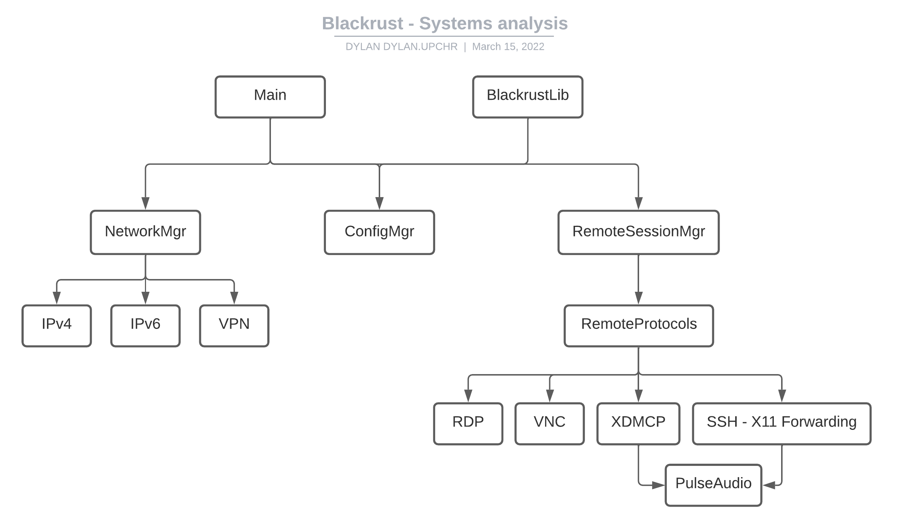
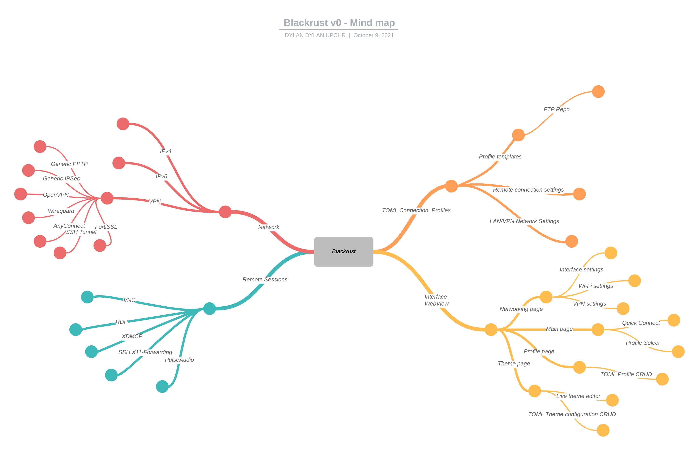

# Cahier des charges
## Résumé / Abstract
Blackrust v0 est un logiciel multi-architecture pour linux qui, au lancement de la machine, proposera des sessions d'accès distant utilisant divers protocoles ainsi qu'une session locale hors-ligne.

Ce projet est un client léger qui a pour but de réduire la taille et le coût des moultes machines données aux employés dans une entreprise. Ces clients légers se connecteraient à un serveur central où résideraient les espaces de travail des utilisateurs avec d'avantage de puissance de calcul.

---

Blackrust v0 is a multi-architecture program for linux that, at the startup of the computer, will offer a remote desktop session via many protocols aswell as an offline local desktop.

This project is a thin client, which aims to reduce the size and cost of the many machines given to employees in a company. These thin clients will connect to a centralized server where the users workspace will be and will offer greater processing power.
## Objectifs
Logiciel qui permet de:

- Démarrer une session d'accès distant avec un des protocoles suivants|
    - RDP
    - VNC
    - XDMCP
    - SSH X11-Forwarding
- Démarrer un desktop en local
- Démarrer un serveur audio distant dans le cas d'une session XDMCP/X11-Forwarding
- Configurer le réseau local à travers NetworkManager
- Configurer une connexion VPN à travers NetworkManager
- Sauvegarder / Modifier / Charger des profiles de connexion
- Sauvegarder / Modifier / Charger des thèmes
## Parties prenantes
| Nom | Fonction |
|-|-|
| Francisco Garcia | Enseignant de suivie / Mandant |
| Pascal Bonvin | Enseignant de suivie / Mandant |
| Dylan Upchurch | Elève / Développeur / Mandataire |

## Environnement
- Matériel
    - Ordinateur de l'école
    - Raspberry Pi Model 4B (4GB) "Testbed"
- Software
    - Arch Linux
        - Visual Studio Code
        - Rust
## Technologies utilisées
| Type | Nom |
|-|-|
| Langage de programmation backend | Rust |
| Langages de programmation frontend | HTML |
| | CSS |
| | JS |
| Protocoles Accès distant | RDP |
| | VNC |
| | SSH X11 Forwarding |
| | XDMCP |
| Serveur d'affichage | X11 |
| Server audio | PulseAudio |
| Outil réseau (LAN/VPN) | NetworkManager |

## Exemples d'utilisation
### Dans un cadre personelle:
Un cas d'utilisation personnel serait si l'on veut avoir un environnement de développement spécifique que l'on héberge à la maison sur un ordinateur puissant, et puis on veut utiliser cet environnement à l'extérieur sur un ordinateur portable bas de gamme. L'environnement de développement aura un serveur d'accès distant tel RDP ou VNC, et possiblement par le biais d'un VPN selon notre configuration. Le logiciel Blackrust pourra proposer de se connecter à cet environnement au démarrage de l'ordinateur portable qu'on soit en vacances ou dans le jardin chez nous.

---
### Dans un cadre professionelle:
Un cas d'utilisation professionnel serait si notre employeur nous met à disposition une infrastructure de bureau virtuel avec le protocole RDP derrière un VPN, puis nous fournit un ordinateur de petite taille ou un ordinateur portable avec le logiciel Blackrust installé. Le logiciel permet de garder le même espace de travail n'importe où on va dans le monde, qu'on soit au bureau ou en télétravail.

## Analyse concurrencielle
### [Remmina](https://remmina.org/)
Remmina est un client de desktop remote pour linux écrit en C et qui utilise la librairie GTK+ pour se connecter à plusieurs types de sessions distants tels que  SSH, VNC, RDP, NX, XDMCP, et même des interfaces HTTP/HTTPS qu'on retrouve sur des routeurs.

Ce logiciel remplit le même besoin et on ressemble beaucoup à ce projet, mais il y a une différence principale entre les deux. Blackrust sera disponible dès le lancement du client, et prendra directement en charge le lancement de la session distant ou de la session locale selon le choix de l'utilisateur. Remmina est une application GTK+ qui est lancée sur le bureau donc intrinsèquement utilise plus de ressources que Blackrust.

Ce programme est gratuit, open source et sous la license Copyleft.

#### Avantages
- Remmina propose les protocoles NX et HTTP/HTTPS en plus de celles de Blackrust
- Système modulaire de plugins pour les protocoles distant
- Interface simple mais fonctionnel
- Open source

#### Inconvenients
- Doit être lancé depuis le bureau Linux

### [MobaXterm](https://mobaxterm.mobatek.net/)
MobaXTerm est un client d'accès distant (SSH, telnet, rlogin, Mosh, RDP, VNC et XDMCP), terminal avec serveur Xorg intégré, et une compilation d'outils système (CygUtils liste matériel/processus ainsi qu'un package manager) et réseau (Serveurs HTTP/telnet/FTP/NFS/VNC/Cron, tunnels SSH, SSH Keygen, netstat, WakeOnLAN, nmap, CygUtils packet capture).

En plus de tout cela, il propose quelques jeux simples et un éditeur de texte. MobaXterm est un environnement de bureau linux complet sur Windows et va bien au-delà de la portée de l'accès distant sur laquel Blackrust se concentre.

Il existe une version gratuite pour l'utilisation personnelle ainsi qu'une version payante avec davantage de fonctionnalités pour les utilisateurs professionels.

Ce programme est propriétaire et distribué sous des licences EULA propres à l'entreprise qui l'a développé, Mobatek.

#### Avantages
- Environnement de bureau linux complet (accès distant, outils, jeux) sur Windows 
- Système modulaire de plugins pour les outils
- Nombre d'outils convenable pour un utilisateur expérimenté / développeur
- Propriétaire

#### Inconvenients
- Doit être lancé depuis le bureau Windows
- Interface complexe
- Nombre d'outils imposant et possiblement intimidant pour l'utilisateur moyen.

### [ThinLinc](https://www.cendio.com/)
ThinLinc est un environnement d'accès distant complet basé sur le VNC qui utilise l'authentification par tunnel SSH avec les entreprises comme publique cible. 

Ils proposent une solution propriétaire qui utilise des librairies open source, afin d'avoir un système client/serveur pour les clients légers interne, et même du télétravail selon la configuration réseau. Ils font partie de la concurrence à ce projet, car ils se situent dans le même domaine et remplissent le même cas d'utilisation, mais ils proposent un écosystème d'accès distant complet alors que Blackrust est un client polyvalent pour les installations basiques de RDP/VNC/SSH/XDMCP.

### [Citrix](https://www.citrix.com/)
Citrix est un environnement d'accès distant complet basé sur le RDP/RDS qui propose de meilleures performances que le RDP/RDS basique avec les entreprise comme publique cible. 

Ils proposent une soultion propriétaire qui utilise des librairies open source, afin d'avoir un système client/serveur pour les clients légers interne, et même du télétravail selon la configuration réseau. Ils font partie de la concurrence à ce projet, car ils se situent dans le même domaine et remplissent le même, cas d'utilisation, mais ils proposent un écosystème d'accès distant complet alors que Blackrust est un client polyvalent pour les installations basiques de RDP/VNC/SSH/XDMCP.
## Analyse système

## Analyse heuristique

## Documentation à fournir
- Documentation utilisateur
- Documentation administrateur
- Rapport de travail
- Journal de bord

## Livrables
- Code source Rust du projet
- Documentation

## Glossaire
#### Serveur d'affichage
Un serveur d'affichage est un programme qui peut exploiter les ressources de rendu graphique pour afficher des applications graphiques.

#### Authentification PAM
PAM, ou Pluggable Authentification Modules, est un mécanisme dans les systèmes d'exploitation UNIX et UNIX-like qui propose des APIs pour l'authentification de bas niveau.

Linux PAM, évolué du UNIX PAM, propose l'authentification de compte locale, LDAP ou de lecteurs d'empreinte digitale.

#### Window Manager
Un Window Manager est un programme qui affiche des applications graphiques dans des fenêtres et gère leur disposition.

#### Display Manager
Un Display Manager est un programme qui, après le lancement du serveur d'affichage (tel X11 ou Wayland), se charge de l'authentification PAM et de lancer un Window Manager.