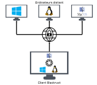
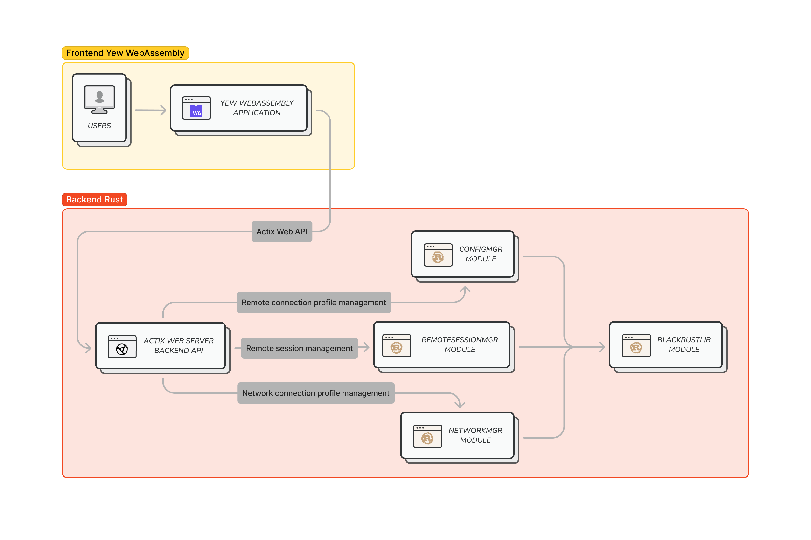
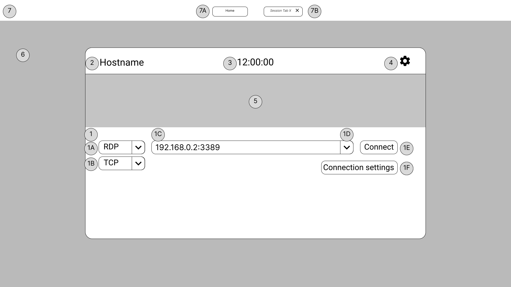
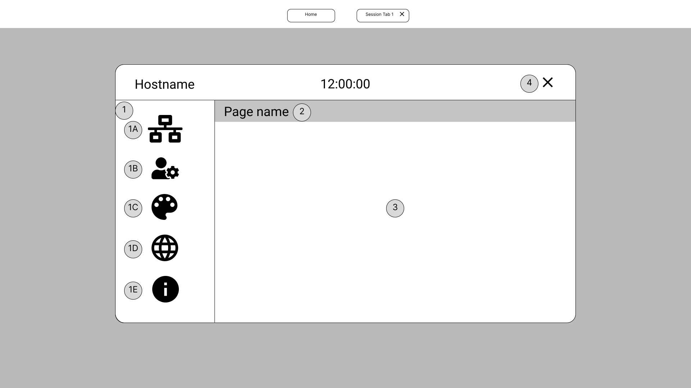
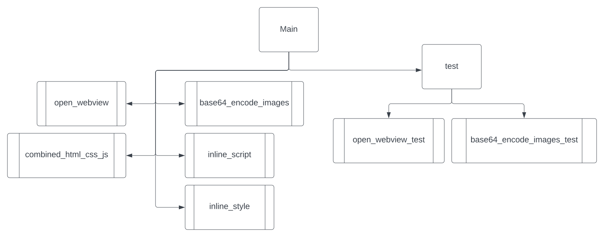
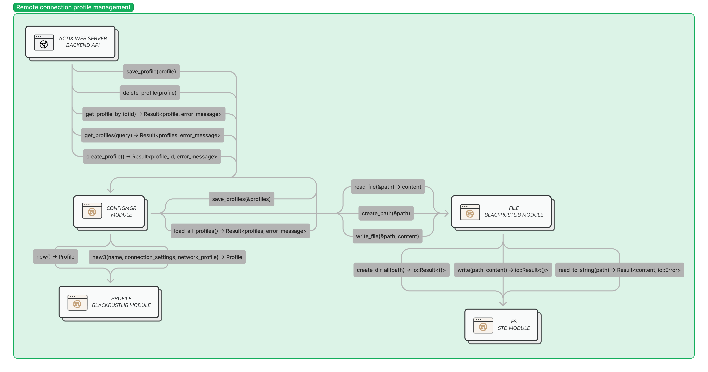
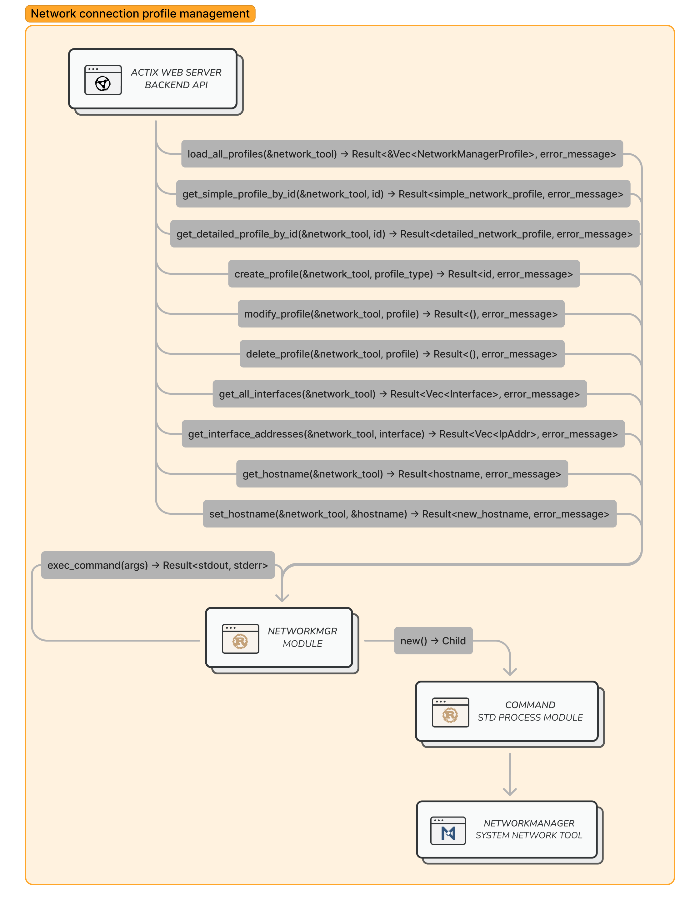
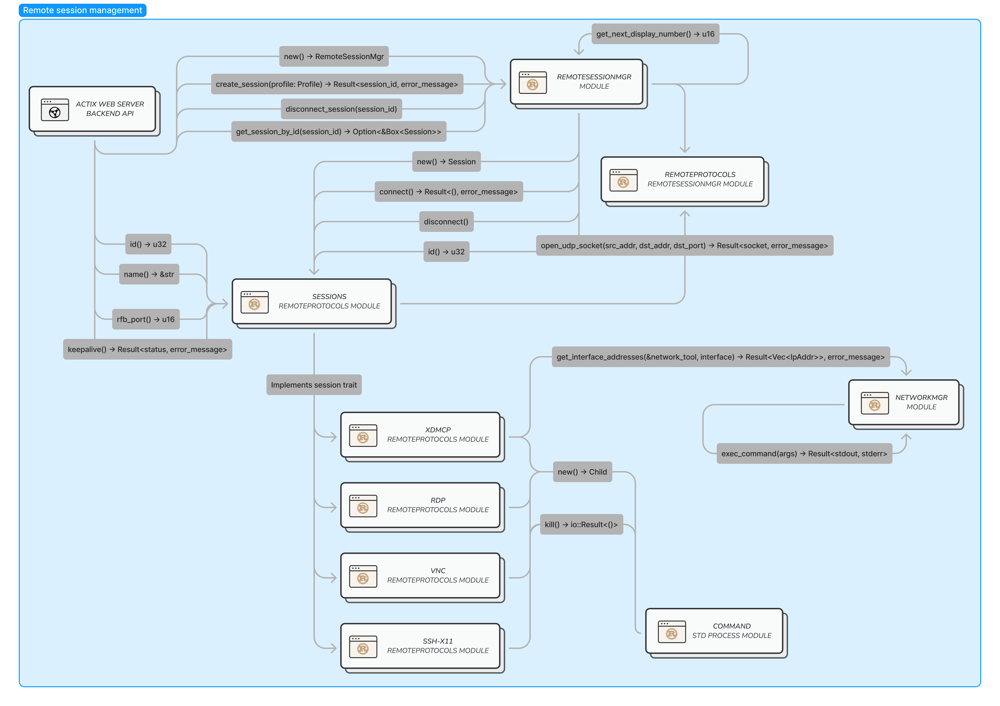

# Rapport du Travail de dîplome
## Résumé / Abstract
Blackrust est un logiciel multiarchitecture pour Linux qui, au lancement de la machine, propose des sessions d'accès distant sécurisés utilisant de divers protocoles ainsi qu'une session locale hors-ligne.

Ce projet est un client léger qui a pour but de réduire la taille et le coût des moultes machines données aux employés dans une entreprise avec de l'infrastructure VDI (virtualisation du poste de travail). Ces clients légers se connecteront à un serveur central où résideront les espaces de travail des utilisateurs avec davantage de puissance de calcul que sur la machine locale.

---

Blackrust is a multi-architecture program for Linux that, at the startup of the computer, offers a secure remote desktop session via many protocols aswell as an offline local desktop.

This project is a thin client, which aims to reduce the size and cost of the many machines given to employees in a company using VDI (virtual desktop infrastructure). These thin clients will connect to a centralized server where the user's workspace resides and offer greater processing power than the local machine.
## Introduction
Blackrust permet de prendre la main sur des ordinateurs à distant en utilisant de divers protocoles d'accès distant afin de pouvoir proposer le plus de compatibilité que possible avec les systèmes distants. Elle permet également d'ouvrir un bureau normale sur la machine locale si une session distante n'est pas souhaitée par l'utilisateur.

L'application propose une interface Web pour interagir avec le backend Rust qui permet de configurer le système local, et se connecter à des systèmes distants à travers des connexions sécurisés.

Voici un diagramme démontrant une architecture de réseau généraliste, où le client Blackrust (représenté en bas du diagramme), se connecte à des clients soit Windows, Linux, MacOS ou autre (ces derniers représentés en haut de l'image) dépendant uniquement du protocole utilisé entre les deux. La connexion se fait de préférence par une connexion sécurisée (représentée au centre de l'image) dépendant de l'environnement à disposition de l'utilisateur.

{ width="300"; margin="auto"}

Cette interoperabilité avec les differentes environnements distants est dû à la diversité de protocolés pris en charge par l'application. Des exemples de ces diverses protocoles sont: 
- RDP fait par Microsoft pour prendre en charge les bureaux distants Windows
- VNC pour les hôtes MacOS / Windows / Linux, ou autres h'otes ou un serveur VNC est deployable.
- XDMCP spécifiquement pour les Linux avec un serveur d'affichage X11
- SSH X11-Forwarding pour une connexion limité à une apllication graphique distante via le SSH

Le frontend de l'applciation est une page Web, soit affiché en locale uniquement soit mis à disposition sur un réseau en tant que serveur Web. La page Web peut ensuite communiquer dans les deux sens à travers le code WebAssembly afin d'interagir avec le backend Rust et afficher les résultats à l'utilisateur finale.

Le backend Rust est compris d'un système de sauvegarde/modification de configuration de connexion, un système de configuration réseau et un système de gestion de connexion. Voici un diagramme démontrant cela.


Le système de configuration permet de gérer les profiles de connexion mémorisés qui sont utilisés pour créer des sessions distantes selon une configuration prédéfinie. Ces profiles sont sauvegardées dans un fichier de données sérialisées en utilisant la langue de markdown TOML.

Le système de configuration réseau communique avec l'outil tiers NetworkManager afin de pouvoir proposer la possibilité d'affecter la configuration réseau du système local et sauvegarder plusieurs configurations réseau et configurations VPN.

Finalement le système de gestion de connexion s'occupe de lancer et gérer des sessions distantes en utilisant les soit profiles prédéfinis soit la saisie utilisateur. La session est lancée dans un affichage X11 "headless" qui est mis à disposition à l'interface Web grâce à un serveur VNC locale.

L'architecture de la partie interface homme-machine, ou IHM, permet de proposer cette application en tant que client logiciel sur une machine indépendant, ainsi qu'en tant que serveur web, proposant les fonctionnalités à tous appareils équipée d'un navigateur. Ceci est dû au fait que l'interface Web délègue tout traitement à un backend, qui peut être disponible uniquement en locale ou derrière un serveur web qui hôte une application web conçue pour ce cas d'utilisation.


## Planning
### Prévisionnel
Le planning prévisionnel a été établi avec la fonctionnalité Gantt de l'outil YouTrack que j'utilise pour la gestion du projet. J'ai choisi de faire avec cet outil car, je peux générer de divers types de rapports sur les tâches accomplies et le temps que ces derniers ont pris.

### Effectif

<div style="page-break-after: always;"></div>

## Analyse de l'existant
Il existe déjà plusieurs solutions pour l'accès distant multiprotocole.
Celles-ci sont la plupart du temps limités en terme de compatibilité avec les différentes architectures système et sont soit propriétaire et/ou payant.

La valeur ajoutée proposée par ma solution est que ceci est léger, sécurisée, multiplateforme et rapide, permettant de tourner sur des machines avec peu de puissance de processeur, laissant de la puissance pour le décodage du flux vidéo de la session distante afin d'offrir une bonne expérience utilisateur. Ma solution est également open source, gratuit et multiplateforme. Ceci permet l'accès ouvert et de l'extensibilité pour les utilisateurs avec des capacités de développement Rust.

Ce qui distingue Blackrust encore plus des autres prestations est son concept. Les autres applications sont des applications desktop faits pour êtres lancés une fois qu'on est déjà connecté sur une session locale, alors que Blackrust se lance avant la session locale et est un Display Manager / client distant. Cela veut dire que l'utilisateur a la possibilité d'uniquement lancer une ou plusieurs sessions distantes ou locales.

Le cahier des charges contient une analyse concurencielle des autres solutions d'accès distant similaires afin de pouvoir se positionner par rapport à eux.

## Cahier des charges
[Lien vers le cahier des charges](index.md)

## Librairies
### Librairie interne
#### Blackrust-Lib
Blackrust-Lib est la libraire commune aux modules et contient les définitions de structures de données et les fonctions utilisées par tous les modules.

### Librairies externes
Le programme utilise également quelques libraires externes écrite en Rust, principalement pour le rendu graphique Web.
Les crates proviennent de [crates.io](https://crates.io), le repository de crates faites par la communauté Rust.
#### Web-view
Web-view est un crate qui agit en tant que navigateur web qui affiche le rendu HTML/CSS/JS.
#### Xrandr
Xrandr permet de récupérer des informations sur le ou les écrans d'affichage, comme taille, DPI, disposition des moniteurs, etc.
#### Serde / Serde-JSON
Serde implémente des fonctionnalités de sérialisation et désérialisation des instances d'objets vers et depuis le JavaScript Object Notation (JSON).
#### Image-base64
Image-base64 est un crate qui encode ou "traduit" des fichiers image en texte base64. **Ceci est nécessaire pour l'instant à cause de WebView qui ne peut pas référencer des fichiers et que traiter du HTML pur. Ceci pourra changer en implémentant Actix (Serveur Web) et Yew (Framework WASM pour Rust)**
#### Regex
Le crate Regex implémente des expressions régulières utilisées pour la vérification des données saisies par l'utilisateur pour la configuration réseau
#### TOML
Le crate TOML est un sérialiseur/déserialiseur de TOML, Tom's Obvious, Minimal Language, qui est la langue de markdon utilisé par Rust pour réprésenter des données
#### Itertools
Le crate Itertools propose davantage de fonctions d'opérations sur les itérables
#### Dirs
Le crate Dirs sert à récupérer des chemins utilisateur selon l'utilisateur, comme la répértoire de fichiers de configuration ou la répértoire home.
#### RSTest
Le crate RSTest est un framework de test qui propose des tests unitaires "Data-Driven"
#### MockAll
Le crate MockAll est un framework de test qui permet de moquer des classes qui impémentent des traits.
#### Xvnc
La commande Xvnc est utilisé pour instancier une affichage headless et un serveur VNC qui mets cet affichage à disposition sur la machine locale
#### NetworkManager
L'outil NetworkManager, utilisé avec la command nmcli, traite toute la configuration réseau locale/VPN

#### Actix Web
Actix Web est une librairie de serveur web. Elle permet de créer et hôter un serveur HTTP/HTTPS avec un page web et/ou un API REST. Je l'utilise pour hôter l'application Web HTML/JS/CSS/WASM construite par Yew.

#### Yew
Yew est un framework Web qui permet de créer une application Web composé de fichiers HTML/JS/CSS/WASM. L'intelligence et logique métier dans l'application est executée en WebAssembly, qui est un nouveau type d'executable haute-performance conçu pour le navigateur.

Yew ressemble à des framework JS tels que React ou Elm, avec leurs systèmes de components. La différence principale est que Yew transpile du code Rust vers le WebAssembly.

<div style="page-break-after: always;"></div>

## Normes
### Nommage
#### Rust
Rust impose le snake case (exemple_nom) pour les noms des fonctions et des variables et pascal case (ExempleNom) pour le nom des objets.
#### JS/HTML
Pour le JS et HTML j'ai choisi d'utiliser le camel case (exempleNom) pour les variables, noms des fonctions et nommage des composants HTML
### Commentaires Rust/JS
Les fichiers ont comme entête le suivant :
```
/** File
 * Author:		Dylan Upchurch
 * Date:		2022-01-01
 * Desc:		File purpose
 */ 
```
#### Rust
Les fonctions sont précédées par un entête comme le suivant :
```
/** Function
 * Name:	fn_name
 * Purpose:	Ce que fait la fonction
 * Args:	(Type) nom_arg: Description argument
 * Returns: (Type) Description valeur de retour
 */
```

Les structs sont précédés par un entête comme le suivant :
```
/** Struct
     * Name:	     StructName
     * Purpose:      A quoi sert le struct
     * Properties:   (Type) nom: Description propriété
     */
```

Les enums sont précédés par un entête comme le suivant :
```
/** Enum
 * Name:    NomEnum
 * Members: NomMembre: Description du membre
 */
```
### JS
Les fonctions sont précédées par un entête comme le suivant :
```
/** Function
 * Name:	functionName
 * Purpose:	Ce que fait la fonction
 * Args:	nom_arg: Description argument
 * Returns: (Type) Description valeur de retour
 */
```

### Commits
Les messages de commits n'ont pas de norme spéciale, le seul forme respectée s'agit d'un commentaire descriptif bref en anglais qui explique ce que contient le commit. Les différentes actions sont séparées par des virgules. Exemple de message de commit : ("Added functionnality X, removed unused code")

## Organisation
La gestion du projet se fait avec l'outil YouTrack. Ce dernier propose des fonctionnalités Gantt, Kanban, relevée d'horaires et de génération de rapports sur ces derniers. 

### Gantt
### Kanban
### Rapports

## Environnement de travail
L'environnement de travail utilisé lors du développement de ce projet consistes-en :

### Matériel
- Ordinateur de l'école "upchr-arch"
- Raspberry Pi Model 4B (4GB) "Testbed-Rpi"
- Jetson Nano Developer Kit "Testbed-JN"
### Software
#### Arch Linux (upchr-arch)
- Visual Studio Code
- Rust "Stable"
#### Raspbian / Debian 11 Bullseye (Testbed-Rpi)
- Blackrust
#### Arch Linux (Testbed-Rpi)
- Blackrust
#### Linux4Tegra (Testbed-JN)
- Blackrust

## Choix du langage
J'ai choisi Rust comme langage pour le travail de semestre, car c'est un langage moderne. Rust est connu pour sa fiabilité, sécurité et rapidité.

### Rapidité
Rust est connu pour sa rapidité grâce à certains caractéristiques :
- Rust est statiquement typé, donc après la vérification de cargo check, pleins de vérifications au runtime peuvent être sautées
- Rust n'as pas de Garbage Collector, la mémoire est alloué et libéré selon "l'espérance de vie" d'une variable et donc ces derniers n'existent aussi longtemps que nécessaire. Ceci réduit les ressources consommées par un Garbage Collector et enlève les tâches répétitives de gérance de mémoire manuelle
- Rust utilise le LLVM pour générer du code assembly optimisé, qui est comparable au GCC en termes de performances du programme final
### Compilateur
L'outil de compilation de Rust, nommée cargo, a plusieurs rôles :
- Package manager, pour les "crates" qui sont les paquets/modules officiels et de la communauté
- Validateur du code, cargo check vérifie plusieurs aspects avant de compiler le programme :
    - Que la gérance du mémoire est bien fait et ne viole pas les règles d'appartenance ou d'emprunt de références
    - Que les variables sont nommées en snake case, sinon il affiche des warnings
    - Qu'il n'y a pas du code "mort", donc pas utilisé, sinon il affiche des warnings
- Compilateur, bien entendu si le code ne contient pas d'erreur de syntaxe, ni de gérance de mémoire le programme est compilée et rends un exécutable dans le dossier target

Les messages d'erreurs de cargo sont assez riches comparés aux autres langages. Cargo peut décrire l'erreur détectée en détail et même selon le type d'erreur, il peut suggérer des solutions. Si cela ne suffit pas, le traçage de la pile d'appels est accessible et peut aider avec le débogage traditionnel.
### Sécurité / Fiabilité
De base, le langage Rust est assez sécure et fiable grâce aux faites suivantes :
- Rust est "memory-safe", qui signifie qu'il ne permet pas d'avoir des pointeurs null ou invalide
- Les courses de données sont également impossible, grâce au système de "appartenance", qui impose qu'une instance ou référence variable ne peut être utilisé par une fonction à la fois.
- La gestion d'erreur est très avancé et devrait être au cœur de la conception d'une fonction. Cette approche permet d'être toujours certain que le déroulement se passe comme prévu et les cas de bords qui pourraient compromettre la sécurité de l'application sont évités.
- Fonctionnalités de tests unitaires intégrées

### Tests unitaires
Rust contient une suite de tests unitaires permettant de fiabiliser le développement continu. Les tests sont des fonctions marquées avec un flag ```#[test] ``` et exécutées avec l'outil interne ```cargo test```.

### Multi-plateforme
Rust est un langage avec un compilateur portable comme le langage C, donc qui peut être compilé sur la plupart des plateformes avec certaines garanties de fonctionnalité. Rust catégorise ces garanties dans un système de tiers. Les tiers sont ainsi :

- Tier 1: Garantie d'exécution, un programme en Rust pure est capable de compiler et de s'exécuter sans problèmes
    - Exemples : x86_64 Windows, x86_64 MacOS, x86_64 Linux, AArch64 Linux (ARM64)
- Tier 2: Garantie de compiler, un programme en Rust pure est capable d'être compilé, mais n'as pas une garantie 100% de fonctionner parfaitement lors de l'éxécution
    - Exemples: iOS, Android, RISC-V, MIPS/MIPS64, PowerPC/PowerPC64 
- Tier 3: Pas de garanties de compilation ni d'exécution, mais ont une possibilité de fonctionner et pour certains des programmes ont déjà été faites
    - Exemples : Apple tvOS, Nintendo 3DS, CUDA, EFI

#### Technologies utilisées
##### WebView
Webkit est un moteur de navigateur développé par Apple parmis d'autres. Le moteur est utilisé par de divers application grâce à son API C++ qui propose des fonctionnalités pour afficher du contenu web dans une fênetre avec des fonctionnalités de navigateur commun comme une historique ou la possibilité de retourner en arrière / aller en avant dans la navigation.

Je l'utilise pour l'interface utilisateur qui est une interface Web qui peut communiquer avec le programme Rust.
##### TOML
TOML, ou Tom's Obvious Markdown Language, est le langage de markdown pour la sérialisation de données choisi par les développeurs de Rust.

Les fichiers TOML sont utilisées pour stocker les profiles connexions dans le répertoire de configuration par défaut de l'utilisateur
##### Github Actions
Github Actions permet d'exécuter dans un environnement sain les tests unitaires lors de chaque push chez Github. Cela me propose une historique de tous les résultats de tests et permet d'avoir un pipeline d'intégration continu.
##### X11
X11 est le serveur d'affichage utilisé pour déja afficher le programme en locale, mais encore peut être utilisée comme serveur d'affichage distant, soit par négociation XDMCP ou par SSH avec le X11-Forwarding
##### NetworkManager
NetworkManager est l'outil de configuration réseau utilisée par mon programme. Cet outil peut configurer, stocker et activer des profiles réseau afin de pouvoir dynamiquement se connecter au différents réseaux locaux ou VPNs selon le profile de connexion choisi.
##### Polkit
Polkit, ou PolicyKit est un gestionnaire de droits au sein de Linux. Je l'utilise pour donner certains accèss à l'utilisateur à la configuration réseau car certaines commandes NetworkManager nécessitent l'authentification.
###### XDMCP
Le protocole distant XDMCP est un des moyens de connexion pour mon application. Elle permet de négotier une connexion entre un serveur X11 locale et un autre distant.
###### RDP
Le protocole distant RDP est un des moyens de connexion pour mon application. Elle est une protocole développé par Microsoft pour l'accès distant sur Windows.
J'exploite ce protocole avec l'outil xfreerdp qui est un client RDP Open-Source fait par la communauté grâce au reverse engineering.
###### VNC
Le protocole distant VNC est un des moyens de connexion pour mon application. J'exploite ce protocole avec l'outil vncviewer de RealVNC.
###### SSH X11-Forwarding
Le protocole distant SSH X11-Forwarding est un des moyens de connexion pour mon application. Elle permet de lancer des applications graphiques sur une session X11 distante, et avoir l'affichage en local par le bias d'une connexion SSH.

<div style="page-break-after: always;"></div>

## Analyse fonctionnelle
L'analyse fonctionnelle définit les fonctionnalités de l'application ainsi que des explications sur les parties de l'interface utilisateur qui permet de les exploiter.
### Maquettes
#### Page principale de connexion

La page d'accueil est le menu utilisé pour se connecter à session distante. Les sessions ouvertes sont ensuite ouvert et affichées, accessibles depuis des onglets.
Voici des explication pour les points associés sur l'image:

- 1: Formulaire de connexion rapide/connexion à un profile
    - 1A: Menu déroulant pour choisir le protocole de la connexion rapide (RDP, VNC, XDMCP, SSH ou session locale)
    - 1B: Menu déroulant pour choisir le protocole de port (TCP ou UDP)
    - 1C: Champs de saisie pour l'adresse IP ou FQDN du serveur distant
    - 1D: Bouton pour ouvrir/fermer le menu déroulant pour choisir les profiles de connexion sauvegardés 
    - 1E: Bouton qui lance la connexion
    - 1F: Bouton qui ouvre un champ de saisie qui permet d'ajouter des connexions spécifiques à la connexion
- 2: Nom d'hôte de la machine
- 3: Heure actuelle
- 4: Bouton pour atteindre les menus de réglage
- 5: Bannièr personnalisable
- 6: Fond d'écran personnalisable
- 7: Barre d'onglets de session
    - 7A: Onglet menu principal
    - 7B: Onglet Session X avec un bouton pour fermer et se déconnecter de la session

#### Template de page de réglages

Le menu de réglages contient plusieurs sous-menus de configuration.
Voici des explication pour les points associés sur l'image:

- 1: Sous-menus de configuration
    - 1A: Sous-menu de réseau
    - 1B: Sous-menu de profiles de connexion
    - 1C: Sous-menu de thème
    - 1D: Sous-menu d'internationalisation, donc langue et locale
    - 1E: Sous-menu "About" qui contient des informations sur l'application
- 2: Nom du sous-menu
- 3: Formulaire du sous-menu
- 4: Bouton pour fermer la page de réglage et retourner vers la page d'acceuil

### Fonctionnalités de l'application
#### Connexion rapide
Un utilisateur a la possibilité de se connecter sans sauvegarder de profile de connexion. La marche à suivre est le suivant:

- Renseigner la configuration réseau avec la page de réglages prévu à cet effet
- Renseigner le protocole utilisé, ainsi que l'IP et le port de la machine distante dans la page de connexion
- Appuyer sur le bouton de connexion
Une fois ces manipulations faites, un onglet avec la session distante s'ouvre et est affiché.
#### Création/Modification/Suppression de profile de connexion
Un utilisateur a la possibilité de gérer ses connexions sauvegardées en utilisant la page de réglage prévu à cet effet. Ce dernier permet les fonctionnalités suivantes:

- Création de profile de connexion
- Modification des paramètres du profile de connexion précédemment crée
- Suppression d'un profile de connexion qui n'est plus souhaitée par l'utilisateur
#### Création/Modification/Suppression de profile de configuration réseau
Un utilisateur a la possibilité de gérer ses configurations réseau sauvegardées en utilisant la page de réglage prévu à cet effet. Ce dernier permet les fonctionnalités suivantes:

- Création de profile de connexion réseau
- Modification des paramètres du profile de connexion réseau précédemment crée
- Suppression d'un profile de connexion réseau qui n'est plus souhaitée par l'utilisateur
Ces actions entrainent des appels à l'outil réseau utilisé par le système afin de déléguer l'affectation des réglages système.
#### Connexion à un profile de connexion
Un utilisateur a la possibilité de se connecter à un serveur distant en utilisant un profile de connexion précédemment renseignée. La marche à suivre est le suivant:

- Choisir le profile de connexion souhaitée dans le composant barre de recherche/menu déroulant prévu à cet effet
- Appuyer sur le bouton de connexion
Une fois ces manipulations faites, un onglet avec la session distante s'ouvre et est affiché.
#### Basculer vers un *n* ème session ouverte ou page de connexion
Un utilisateur a la possibilité d'ouvrir plusieurs sessions et lors de l'usage de l'application, afficher la session qu'il désire utiliser en utilisant le système d'onglets prévu à cet effet.
Une barre d'onglets est affiché sur le haut de l'écran contenant les onglets qui représentent les sessions, ainsi que l'onglet qui représente la page de connexion permettant à l'utilisateur de naviguer l'application.

<div style="page-break-after: always;"></div>

## Analyse organique
### Architecture
#### Modules internes

Le programme est décomposé en 5 modules principaux :

- Main (DM): Point d'entrée du programme et aperçu graphique
- ConfigMgr: CRUD pour les options de connexion sauvegardées
- NetworkMgr: Module qui configure le réseau (IPv4, IPv6, configuration VPN) à travers la commande `nmcli` de [NetworkManager](https://networkmanager.dev/)
- RemoteSessionMgr: Module qui lance et gère de sessions distant
    - RemoteProtocols 
        - XDMCP
        - VNC
        - RDP
        - SSH
- BlackrustLib: Fonctions communes à plusieurs modules, librairie interne
##### Main
Le module main est le point d'entrée principale de l'application, lance l'aperçu WebView qui permet d'interfacer avec l'application et appeler les autres modules


###### Data flow
Le diagramme suivant détaille le dataflow du crate Main et représente graphiquement l'interaction entre l'utilisateur et les différents modules.
L'utilisateur final interagit avec l'interface Web mise à disposition par le moteur Webkit qui propose une sorte de navigateur appelé Webview. Cette interface Web communique ensuite bilatéralement avec le invoke handler de la partie "Backend" du Webview, qui est écrit en Rust. Le invoke handler éxpedie les différents appels vers les modules appropriés et rappel des fonctions JS avec le résultat si cela est nécessaire. Les modules Rust utilisent tous des modules de la librairie interne "BlackrustLib" représenté sur la droite du diagramme. Les modules de la librairie interne contiennent des définitions de types et des fonctions communes à tous les modules principales.

###### Fonctions
- ```open_webview```: Instancie et affiche l'interface WebView

    - **Type de retour**
    - |Type|Description|
|-|-|
|Result<<Webview\>, String>|Resultat rendant soit un Webview, soit un message d'erreur se rapportant au construction du Webview|

- ```combined_html_css_js```: Concaténation des sources HTML, CSS et JS pour le WebView, qui ne prend que de l'HTML

    - **Type de retour**
    - |Type|Description|
|-|-|
|String|Code HTML contenant la page HTML, le style CSS et le code JavaScript en balises ```<style></style>``` et ```<script></script>``` respectivement|

- ```base64_encode_images```: Encode des images en format de données base64, et remplacement des chemins vers les images dans l'HTML avec les données base64
 
    - **Arguments**

    - | Nom | Type | Description |
|-|-|-|
|html|&str|Référence de chaîne de caractères contenant le code HTML|
|web_dir_prefix|&str|Référence de chaîne de caractères contenant le préfixe du répertoire contenant les sources de l'interface web|

    - **Type de retour**
    - |Type|Description|
|-|-|
|String|String contenant le code HTML avec les images encodée en base64|

- ```inline_style```: Formate du code CSS en balise ```<style></style>``` HTML
    - **Arguments**

    - | Nom | Type | Description |
|-|-|-|
|css|&str|Référence de chaîne de caractères contenant le code CSS|

    - **Type de retour**
    - |Type|Description|
|-|-|
|String|String contenant le code HTML avec le code CSS en balise ```<style></style>```|
- ```inline_script```: Formate du code JS en balise ```<script></script>``` HTML
    - **Arguments**

    - | Nom | Type | Description |
|-|-|-|
|js|&str|Référence de chaîne de caractères contenant le code CSS|

    - **Type de retour**
    - |Type|Description|
|-|-|
|String|String contenant le code HTML avec le code JS en balise ```<script></script>```|
###### Tests unitaires
- ```test::open_webview_test```: Test que l'affichage puisse s'instancier et s'afficher, ainsi que la gestion d'erreur de ceci
- ```test::base64_encode_images_test```: Test que l'encodage et remplacement des images dans une balise ```</img>``` fonctionne

##### ConfigMgr
Le module ConfigMgr gère les profils de connexion de session distante avec des fonctions CRUD (Création, Lecture, Mise à Jour, Suppression). Ses fonctionnalités sont appelées depuis le Invoke Handler du WebView et donc depuis le JS de l'interface utilisateur.


###### Data flow

###### Fonctions
- ```get_profiles```: Récupère tous les profiles de connexion répondant à une requête de recherche
    - **Arguments**

    - | Nom | Type | Description |
|-|-|-|
|query|String|Nom/Addresse à utiliser pour filtrer les profiles|

    - **Type de retour**
    - |Type|Description|
|-|-|
|Result<<Profiles\>, String>|Objet contentant une liste des profiles ou message d'erreur|
- ```get_profile_by_id```: Récupère un profile de connexion à partir de son identifiant
    - **Arguments**

    - | Nom | Type | Description |
|-|-|-|
|id|String|Identifiant unique du profile demandé|

    - **Type de retour**
    - |Type|Description|
|-|-|
|Option<Profile\>|Profile avec l'identifiant unique demandé s'il existe|
- ```load_all_profiles```: Instancie tout les profiles depuis des enregistrements dans un fichier .toml

    - **Type de retour**
    - |Type|Description|
|-|-|
|Result<Profiles, String\>|Objet contentant une liste des profiles ou message d'erreur|
- ```save_profile```: Sauvegarde un profile modifié
    - **Arguments**

    - | Nom | Type | Description |
|-|-|-|
|profile|Profile|Profile à sauvegarder|
- ```save_profiles```: Sauvegarde tout les profiles dans un fichier .toml
    - **Arguments**

    - | Nom | Type | Description |
|-|-|-|
|profiles|&Profiles|Référence d'objet contenant une liste de profiles|
- ```create_profile```: Instancie et sauvegarde une nouvelle profile
    - **Type de retour**
    - |Type|Description|
|-|-|
|Result<String, String\>|Identifiant unique du profile crée ou message d'erreur|
- ```delete_profile```: Supprime un profile de connexion 
    - **Arguments**

    - | Nom | Type | Description |
|-|-|-|
|profile|Profile|Profile à supprimer|
###### Tests unitaires
##### NetworkMgr
Le module NetworkMgr permet de faire des appels vers NetworkManager pour configurer les interfaces réseau afin de pouvoir se connecter au réseau local et éventuellement à un VPN.


###### Data flow

###### Fonctions
- ```exec_command```: Exécute une commande de l'outil système de configuration réseau
    - **Arguments**

    - | Nom | Type | Description |
|-|-|-|
|args|Vec<&str>|Liste d'arguments à passer à l'outil système de configuration réseau|

    - **Type de retour**
    - |Type|Description|
|-|-|
|Result<String, String\>|Sortie "stdout" contenant le retour de l'outil réseau ouo true will list out of anchor points provided during the build as info message
|Result<String, String\>|Nom d'hôte du système ou message d'erreur|
- ```set_hostname```: Affecte le nom d'hôte de la machine locale
    - **Arguments**

    - | Nom | Type | Description |
|-|-|-|
|network_tool|&NetworkTool|Référence vers l'instance de l'outil réseau|

    - **Type de retour**
    - |Type|Description|
|-|-|
|Result<String, String\>|Nom d'hôte du système ou message d'erreur|
- ```get_all_interfaces```: Récupère les interfaces réseau de la machine locale
    - **Arguments**

    - | Nom | Type | Description |
|-|-|-|
|network_tool|&NetworkTool|Référence vers l'instance de l'outil réseau|

    - **Type de retour**
    - |Type|Description|
|-|-|
|Result<Vec<Interface>, String\>|Liste d'interfaces réseau ou message d'erreur|
- ```get_interface_by_name```: Récupère une interface selon son nom
    - **Arguments**

    - | Nom | Type | Description |
|-|-|-|
|network_tool|&NetworkTool|Référence vers l'instance de l'outil réseau|
|name|String|Nom de l'interface réseau recherché|
    - **Type de retour**
    - |Type|Description|
|-|-|
|Option<Interface\>|L'interface réseau s'il existe|
- ```get_interface_address```: Récupère l'adresse IP d'une interface
    - **Arguments**

    - | Nom | Type | Description |
|-|-|-|
|network_tool|&NetworkTool|Référence vers l'instance de l'outil réseau|
|interface|Interface|Interface depuis laquel récuperer les adresses IP|
    - **Type de retour**
    - |Type|Description|
|-|-|
|Result<Vec<IpAddr>, String>|Liste des adresses IP ou message d'erreur|
- ```load_all_profiles```: Charge tout les profiles réseau depuis l'outil de réseau
    - **Arguments**

    - | Nom | Type | Description |
|-|-|-|
|network_tool|&NetworkTool|Référence vers l'instance de l'outil réseau|
    - **Type de retour**
    - |Type|Description|
|-|-|
|Result<Vec<NetworkManagerProfile\>, String>|Liste de profiles réseau ou message d'erreur|
- ```get_simple_profile_by_id```: Récupère des informations basiques sur un profile réseau à partir de son identifiant
    - **Arguments**

    - | Nom | Type | Description |
|-|-|-|
|network_tool|&NetworkTool|Référence vers l'instance de l'outil réseau|
|id|String|Identifiant unique du profile recherché|
    - **Type de retour**
    - |Type|Description|
|-|-|
|Result<Vec<NetworkManagerProfile\>, String>|Liste de profiles réseau ou message d'erreur|
- ```get_detailed_profile_by_id```: Récupère des informations détaillées sur un profile réseau à partir de son identifiant
    - **Arguments**

    - | Nom | Type | Description |
|-|-|-|
|network_tool|&NetworkTool|Référence vers l'instance de l'outil réseau|
    - **Type de retour**
    - |Type|Description|
|-|-|
|Result<Vec<NetworkManagerProfile\>, String>|Liste de profiles réseau ou message d'erreur|
- ```create_profile```: Crée un nouveau profile réseau avec l'outil réseau
    - **Arguments**

    - | Nom | Type | Description |
|-|-|-|
|network_tool|&NetworkTool|Référence vers l'instance de l'outil réseau|
|profile_type|NetworkManagerProfileType|Type de profil réseau à créer (Wifi, Ethernet, etc.)|
    - **Type de retour**
    - |Type|Description|
|-|-|
|Result<String, String\>|Identifiant unique du profile crée ou message d'erreur|
- ```modify_profile```: Modifie un profile réseau avec l'outil réseau
    - **Arguments**

    - | Nom | Type | Description |
|-|-|-|
|network_tool|&NetworkTool|Référence vers l'instance de l'outil réseau|
|profile|NetworkManagerProfile|Profile avec valeurs modifiées|
    - **Type de retour**
    - |Type|Description|
|-|-|
|Result<(), String>|Retour vide ou message d'erreur|
- ```delete_profile```: Supprime un profile réseau avec l'outil 
    - **Arguments**

    - | Nom | Type | Description |
|-|-|-|
|network_tool|&NetworkTool|Référence vers l'instance de l'outil réseau|
|profile|NetworkManagerProfile|Profile à supprimer|
    - **Type de retour**
    - |Type|Description|
|-|-|
|Result<(), String>|Retour vide ou message d'erreur|
###### Tests unitaires
- ```test::get_hostname_test```: Test que la commande pour récupérer le nom d'hôte est correcte
- ```test::set_hostname_test```: Test que la commande pour affecter le nom d'hôte est correcte
- ```test::get_all_interfaces_test```: Test que la commande pour récuperer les interfaces est correcte
- ```test::get_interface_by_name_test```: Test que la récupération d'interface réussi
- ```test::get_interface_address_test```: Test que la récupération d'adresse réussi
- ```test::load_all_profiles_test```: Test que la récupération de profiles réussi
- ```test::get_simple_profile_by_id_test```: Test que la récupération de profile simple réussi
- ```test::get_detailed_profile_by_id_test```: Test que la récupération de profile détaillée réussi
- ```test::create_profile_test```: Test que la commande pour créer un profile est correcte
- ```test::modify_profile_test```: Test que la commande pour modifier un profile est correcte
- ```test::delete_profile_test```: Test que la commande pour supprimer un profile est correcte
- ```test::exec_command_test```: Test que l'outil réseau puisse accepter des commandes correctement
##### RemoteSessionMgr
Le module RemoteSessionMgr lance les sessions distantes en utilisant les options de connexion soit fournies par l'utilisateur soit par un profile chargé par l'utilisateur. Ce module fait appel aux commandes tel xfreerdp, vncviewer, Xnest ou ssh.


###### Data flow

###### Fonctions
- ```connect```: Se connecte à un protocol distant du profile de connexion fourni
- ```remote_protocols::open_udp_socket```: Ouvre un canal de communication UDP entre un serveur distant et la machine actuelle
- ```remote_protocols::xdmcp::send```: Envoi un packet du protocole XDMCP
- ```remote_protocols::xdmcp::recv```: Attends la récéption d'un packet du protocole XDMCP
- ```remote_protocols::xdmcp::open_session```: Négocie une session XDMCP avec un serveur XDMCP distant
- ```remote_protocols::xdmcp::build_request_packet```: Construit un packet de l'opération Request du protocole XDMCP
- ```remote_protocols::xdmcp::build_manage_packet```: Construit un packet de l'opération Manage du protocole XDMCP
- ```remote_protocols::xdmcp::add_xauth_cookie```: Ajoute un cookie d'authentification MIT_MAGIC_COOKIE-1 au XAuthority du système
- ```remote_protocols::xdmcp::read_card```: Lit un nombre de bytes d'un buffer à un offset donné depuis le buffer
- ```remote_protocols::xdmcp::read_card_8```: Lit une valeur de taille 1 byte à un offset donné depuis le buffer
- ```remote_protocols::xdmcp::read_card_16```: Lit une valeur de taille 2 bytes à un offset donné depuis le buffer
- ```remote_protocols::xdmcp::read_card_32```: Lit une valeur de taille 4 bytes à un offset donné depuis le buffer
- ```remote_protocols::xdmcp::read_array_8```: Lit un array de valeurs 1 byte de taille variable à un offset donné depuis le buffer
- ```remote_protocols::xdmcp::append_card_8```: Ajoute une valeur de taille 1 byte à la fin du buffer
- ```remote_protocols::xdmcp::append_card_16```: Ajoute une valeur de taille 2 bytes à la fin du buffer
- ```remote_protocols::xdmcp::append_card_32```: Ajoute une valeur de taille 4 bytes à la fin du buffer
- ```remote_protocols::xdmcp::append_array_8```: Ajoute un array de valeurs 1 byte de taille variable à la fin du buffer
- ```remote_protocols::xdmcp::append_array_16```: Ajoute un array de valeurs 2 bytes de taille variable à la fin du buffer
- ```remote_protocols::xdmcp::append_array_of_array_8```: Ajoute un array de array de valeurs 2 bytes de taille variable à la fin du buffer
- ```remote_protocols::xdmcp::vec_u16_to_be_vec_u8```: Convertit un vecteur de valeurs de 2 bytes en vecteur de valeurs de 1 byte big-endian
- ```remote_protocols::xdmcp::vec_u8_to_string``` Convertit un vecteur de valeurs 1 byte en string hexadécimale
###### Tests unitaires

## Tests
### Tests unitaires
Rust propose des tests unitaires prallèlisés intégré dans les outils de base. L'outil en ligne de commande est ```cargo test```. De plus, les tests peuvent être étendus avec des crates prévu à cet effet comme rstest ou mockall, qui sont des crates qui proposent des tests data-driven et du mocking automatique pour des traits/structs. 

Les tests sont exécutés lors du développement sur la machine locale, ainsi que sur Github grâce à Github Actions à chaque push vers le repo. Les tests de Github Actions sont exécutés dans un containeur sain ou les étapes de setup nécessaire sont refait à chaque push pour s'assurer que le build peut être déployé et utilisé sur un système vièrge et qu'il n'y a pas de problèmes d'état entre deux builds liée à la machine de test.
#### Périmètre des tests
Les scénarios suivants sont testés :

- Les paniques
- Lancement du WebView
- La génération de la page web réussit
- Que la génération de profile se crée, lit, modifie, et supprime
- Que la génération de configuration réseau se crée, lit, modifie et supprime
- Que l'envoi et la réception de packet TCP/UDP s'effectue

##### Format description des tests
Le format choisi pour décrire les tests unitaires est le suivant :
```md
###### fn_name_test
Description de la fonction.
| Propriété | Valeur |
|-|-|
| **Nom** | ```fn_name_test``` |
| **Nom de la fonction testée** | ```fn_name``` |
| **Fichier** | ```file.rs``` |
| **Cas *n*** ||
| *Description* | Description du cas testée |
| *Type de résultat attendu* | Réussite/Échec |
| *Critère(s) d'acceptation* ||
| *Critère(s) d'échec* ||
```
Ce qui donne le rendu suivant :
###### fn_name_test
Description de la fonction.
| Propriété | Valeur |
|-|-|
| **Nom** | ```fn_name_test``` |
| **Nom de la fonction testée** | ```fn_name``` |
| **Fichier** | ```file.rs``` |
| **Cas *n*** ||
| *Description* | Description du cas testée |
| *Type de résultat attendu* | Réussite/Échec |
| *Critère(s) d'acceptation* ||
| *Critère(s) d'échec* ||

##### Description des tests
###### open_webview_test
La fonction ```open_webview``` sert à instancier et lancer l'interface WebView depuis les sources HTML/CSS/JS.

| Propriété | Valeur |
|-|-|
| **Nom** | ```open_webview_test``` |
| **Nom de la fonction testée** | ```open_webview``` |
| **Fichier** | ```dm.rs``` |
| **Cas 1** ||
| *Description* | Cas qui assure que la construction et affichage de l'interface WebView est réussi |
| *Type de résultat attendu* | Réussite |
| *Critère(s) d'acceptation* | Valeur de type Ok est émis par open_webview qui indique que l'objet s'est bien instanciée |
|| Le WebView se lance dans le serveur Xorg headless (mock d'interface/dummy)|
| *Critère(s) d'échec* | Valeur de type Err est émis par open_webview avec un message d'erreur qui indique que l'objet s'est bien instanciée |
|| Le WebView lance une exception indiquant qu'il n'a pas pu se lancer dans le serveur Xorg headless (mock d'interface/dummy) |

###### base64_encode_images_test
La fonction ```base64_encode_images``` utilise une expression régulière (RegEx) dans un premier temps pour détecter des balises `````` avec un attribut ```src``` qui a comme valeur un chemin vers une image. Dans un deuxième temps, la fonction lit l'image et l'encode en format de chaîne de caractères base64, puis remplace le chemin avec la chaîne base64 avec la même expression régulière afin d'inclure l'image directement dans la page HTML.

| Propriété | Valeur |
|-|-|
| **Nom** | ```base64_encode_images_test``` |
| **Nom de la fonction testée** | ```base64_encode_images``` |
| **Fichier** | ```dm.rs``` |
| **Cas 1** ||
| *Description* | Cas qui assure que la détection de balise, l'encodage d'image exemple de taille 8 pixel x 8 pixels et finalement le replacement de la valeur de l'attribut ```src``` sont réussis |
| *Type de résultat attendu* | Réussite |
| *Critère(s) d'acceptation* | String contenant le HTML encodé émis et conforme au résultat attendu |
| *Critère(s) d'échec* | String contenant le HTML encodé émis mais, non conforme au résultat attendu |
|| Panique de la fonction base64_encode_images |

###### exec_command_test
La fonction ```exec_command```, provenant du trait NetworkTool, exécute une commande shell avec les arguments fournis pour l'outil implémentée (dans ce cas ```nmcli``` de NetworkManager) et rend soit le stdout en valeur de type Ok(String) ou le stderr en valeur de type Err(String).

| Propriété | Valeur |
|-|-|
| **Nom** | ```exec_command_test``` |
| **Nom de la fonction testée** | ```exec_command``` |
| **Fichier** | ```network_mgr.rs``` |
| **Cas 1** ||
| *Description* | Cas qui assure que la commande ```nmcli``` avec les arguments ```connection show``` rends une valeur de type Ok(String). Ceci vérifie qu'une commande valide émets une valeur Ok avec le stdout de la commande. |
| *Type de résultat attendu* | Réussite |
| *Critère(s) d'acceptation* | Valeur de type Ok(String) avec stdout comme contenu émis |
| *Critère(s) d'échec* | Valeur de type Err(String) avec stderr comme contenu émis |
| **Cas 2** ||
| *Description* | Cas qui assure que la commande ```nmcli``` avec les arguments ```show``` rends une valeur de type Ok(String). Ceci vérifie qu'une commande invalide émets une valeur Err avec le stderr de la commande. |
| *Type de résultat attendu* | Échec |
| *Critère(s) d'acceptation* | Valeur de type Err(String) avec stderr comme contenu est émis |
| *Critère(s) d'échec* | Valeur de type Ok(String) avec stdout comme contenu est émis |

###### get_hostname_test
La fonction ```get_hostname``` utilise le NetworkTool fourni pour récupérer le nom d'hôte de la machine.

| Propriété | Valeur |
|-|-|
| **Nom** | ```get_hostname_test``` |
| **Nom de la fonction testée** | ```get_hostname``` |
| **Fichier** | ```network_mgr.rs``` |
| **Cas 1** ||
| *Description* | Cas qui assure avec un MockNetworkTool que la récupération du nom d'hôte de la machine réussi |
| *Type de résultat attendu* | Réussite |
| *Critère(s) d'acceptation* | Valeur de type Ok(String) contenant le nom d'hôte est émis |
| *Critère(s) d'échec* | Valeur de type Err(String) contenant un message d'erreur est émis |
| **Cas 2** ||
| *Description* | Cas qui assure avec un MockNetworkTool que la gestion d'erreur fonctionne. Ceci est dans le cas que la commande exécutée émet une erreur |
| *Type de résultat attendu* | Échec |
| *Critère(s) d'acceptation* | Valeur de type Err(String) contenant un message d'erreur est émis |
| *Critère(s) d'échec* | Valeur de type Ok(String) contenant le nom d'hôte est émis |

###### set_hostname_test
La fonction ```set_hostname``` utilise le NetworkTool fourni pour affecter le nom d'hôte de la machine.

| Propriété | Valeur |
|-|-|
| **Nom** | ```set_hostname_test``` |
| **Nom de la fonction testée** | ```set_hostname``` |
| **Fichier** | ```network_mgr.rs``` |
| **Cas 1** ||
| *Description* | Cas qui assure avec un MockNetworkTool que l'affectation de nom d'hôte réussi. |
| *Type de résultat attendu* | Réussite |
| *Critère(s) d'acceptation* | Valeur de type Ok(String) émis |
| *Critère(s) d'échec* | Valeur de type Err(String) contenant un message d'erreur est émis |
| **Cas 2** ||
| *Description* | Cas qui assure avec un MockNetworkTool que la gestion d'erreur fonctionne. Ceci est dans le cas que la commande exécutée émet une erreur. |
| *Type de résultat attendu* | Échec |
| *Critère(s) d'acceptation* | Valeur de type Err(String) contenant un message d'erreur est émis |
| *Critère(s) d'échec* | Valeur de type Ok(String) émis |

###### get_all_interfaces_test
La fonction ```get_all_interfaces``` utilise le NetworkTool fourni pour récuperer les interfaces réseau de la machine.

| Propriété | Valeur |
|-|-|
| **Nom** | ```get_all_interfaces_test``` |
| **Nom de la fonction testée** | ```get_all_interfaces``` |
| **Fichier** | ```network_mgr.rs``` |
| **Cas 1** ||
| *Description* | Cas qui assure avec un MockNetworkTool que la récupération de la liste d'interfaces réseau réussi |
| *Type de résultat attendu* | Réussite |
| *Critère(s) d'acceptation* | Valeur de type Ok(Vec<Interface\>) non-vide émis |
| *Critère(s) d'échec* | Valeur de type Err(String) contenant un message d'erreur est émis |
| **Cas 2** ||
| *Description* | Cas qui assure avec un MockNetworkTool que la gestion d'erreur fonctionne. Ceci est dans le cas que la commande exécutée émet une erreur. |
| *Type de résultat attendu* | Échec |
| *Critère(s) d'acceptation* | Valeur de type Err(String) contenant un message d'erreur est émis |
| *Critère(s) d'échec* | Valeur de type Ok(Vec<Interface\>) émis |

###### get_interface_by_name_test
La fonction ```get_interface_by_name``` utilise le NetworkTool fourni pour récuperer une interface réseau de la machine depuis son nom.

| Propriété | Valeur |
|-|-|
| **Nom** | ```get_interface_by_name_test``` |
| **Nom de la fonction testée** | ```get_interface_by_name``` |
| **Fichier** | ```network_mgr.rs``` |
| **Cas 1** ||
| *Description* | Cas qui assure avec un MockNetworkTool que la récupération d'une interface mock loopback fonctionne |
| *Type de résultat attendu* | Réussite |
| *Critère(s) d'acceptation* | Valeur de type Some(Interface) contenant une interface avec les propriétés renseignées est émis |
| *Critère(s) d'échec* | Valeur de type None est émis |
| **Cas 2** ||
| *Description* | Cas qui assure avec un MockNetworkTool que dans la possibilité ou il n'y a pas d'interface assignée à un profile, la valeur None est émis |
| *Type de résultat attendu* | Échec |
| *Critère(s) d'acceptation* | Valeur de type None est émis |
| *Critère(s) d'échec* | Valeur de type Some est émis |
| **Cas 3** ||
| *Description* | Cas qui assure avec un MockNetworkTool que si l'interface avec le nom donnée n'existe pas, la valeur None est émis |
| *Type de résultat attendu* | Échec |
| *Critère(s) d'acceptation* | Valeur de type None est émis |
| *Critère(s) d'échec* | Valeur de type Some est émis |

###### load_all_profiles_test
La fonction ```load_all_profiles``` charge et instancie tout les profiles de connexion stockées par le NetworkTool fourni.

| Propriété | Valeur |
|-|-|
| **Nom** | ```load_all_profiles_test``` |
| **Nom de la fonction testée** | ```load_all_profiles``` |
| **Fichier** | ```network_mgr.rs``` |
| **Cas 1** ||
| *Description* | Cas qui assure avec un MockNetworkTool que la récupération de profile fonctionne |
| *Type de résultat attendu* | Réussite |
| *Critère(s) d'acceptation* | Valeur de type Ok(Vec<Interface\>) contenant un profile avec les propriétés renseignées est émis|
| *Critère(s) d'échec* | Valeur de type Err(String) contenant un message d'erreur est émis |
| **Cas 2** ||
| *Description* | Cas qui assure avec un MockNetworkTool que la gestion d'erreur fonctionne. Ceci est dans le cas que la commande exécutée émet une erreur. |
| *Type de résultat attendu* | Échec |
| *Critère(s) d'acceptation* | Valeur de type Err(String) contenant un message d'erreur est émis |
| *Critère(s) d'échec* |Valeur de type Ok(Vec<Interface\>) est émis |

###### create_profile_test
La fonction ```create_profile``` crée un profile de connexion réseau avec le NetworkTool fourni.

| Propriété | Valeur |
|-|-|
| **Nom** | ```create_profile_test``` |
| **Nom de la fonction testée** | ```create_profile``` |
| **Fichier** | ```network_mgr.rs``` |
| **Cas 1** ||
| *Description* | Cas qui assure avec un MockNetworkTool que la création de profile de connexion réseau fonctionne. |
| *Type de résultat attendu* | Réussite |
| *Critère(s) d'acceptation* | Valeur de type Ok(String) contenant l'identifiant du nouveau profile est émis |
| *Critère(s) d'échec* | Valeur de type Err(String) contenant un message d'erreur est émis |
| **Cas 2** ||
| *Description* | Cas qui assure avec un MockNetworkTool que la gestion d'erreur fonctionne. Ceci est dans le cas que la commande exécutée émet une erreur. |
| *Type de résultat attendu* | Échec |
| *Critère(s) d'acceptation* | Valeur de type Err(String) contenant un message d'erreur est émis |
| *Critère(s) d'échec* | Valeur de type Ok(String) est émis|

###### get_simple_profile_by_id_test
La fonction ```get_simple_profile_by_id``` récupère un profile avec des informations basiques par son identifiant unique.

| Propriété | Valeur |
|-|-|
| **Nom** | ```get_simple_profile_by_id_test``` |
| **Nom de la fonction testée** | ```get_simple_profile_by_id``` |
| **Fichier** | ```network_mgr.rs``` |
| **Cas 1** ||
| *Description* | Cas qui assure avec un MockNetworkTool que la récupération des informations basique depuis un identifiant fonctionne. |
| *Type de résultat attendu* | Réussite |
| *Critère(s) d'acceptation* | Valeur de type Ok(NetworkManagerProfile) contenant le profile demandée est émis |
| *Critère(s) d'échec* | Valeur de type Err(String) contenant un message d'erreur est émis  |
| **Cas 2** ||
| *Description* | Cas qui assure avec un MockNetworkTool que la gestion d'erreur fonctionne. Ceci est dans le cas que la commande exécutée émet une erreur ou que le profile demandée n'a pas été trouvée.  |
| *Type de résultat attendu* | Échec |
| *Critère(s) d'acceptation* | Valeur de type Err(String) contenant un message d'erreur est émis |
| *Critère(s) d'échec* | Valeur de type Ok(NetworkManagerProfile) est émis |

###### get_detailed_profile_by_id_test
La fonction ```get_detailed_profile_by_id``` récupère un profile avec des informations détaillées par son identifiant unique.

| Propriété | Valeur |
|-|-|
| **Nom** | ```get_detailed_profile_by_id_test``` |
| **Nom de la fonction testée** | ```get_detailed_profile_by_id``` |
| **Fichier** | ```network_mgr.rs``` |
| **Cas 1** ||
| *Description* | Cas qui assure avec un MockNetworkTool que la récupération des informations détaillées depuis un identifiant fonctionne. |
| *Type de résultat attendu* | Réussite |
| *Critère(s) d'acceptation* | Valeur de type Ok(NetworkManagerProfile) contenant le profile demandée est émis |
| *Critère(s) d'échec* | Valeur de type Err(String) contenant un message d'erreur est émis |
| **Cas 2** ||
| *Description* | Cas qui assure avec un MockNetworkTool que la gestion d'erreur fonctionne. Ceci est dans le cas que la commande exécutée émet une erreur ou que le profile demandée n'a pas été trouvée. |
| *Type de résultat attendu* | Échec |
| *Critère(s) d'acceptation* | Valeur de type Err(String) contenant un message d'erreur est émis |
| *Critère(s) d'échec* | Valeur de type Ok(NetworkManagerProfile) est émis |

###### modify_profile_test
La fonction ```modify_profile``` modifie un profile avec le NetworkTool fourni.

| Propriété | Valeur |
|-|-|
| **Nom** | ```modify_profile_test``` |
| **Nom de la fonction testée** | ```modify_profile``` |
| **Fichier** | ```network_mgr.rs``` |
| **Cas *n*** ||
| *Description* | Description du cas testée |
| *Type de résultat attendu* | Réussite/Échec |
| *Critère(s) d'acceptation* ||
| *Critère(s) d'échec* ||

###### delete_profile_test
La fonction ```delete_profile``` supprime un profile avec le NetworkTool fourni.

| Propriété | Valeur |
|-|-|
| **Nom** | ```delete_profile_test``` |
| **Nom de la fonction testée** | ```delete_profile``` |
| **Fichier** | ```network_mgr.rs``` |
| **Cas 1** ||
| *Description* | Cas qui assure avec un MockNetworkTool que la suppresion d'un profile fonctionne.  |
| *Type de résultat attendu* | Réussite |
| *Critère(s) d'acceptation* | Valeur de type Ok(()) est émis |
| *Critère(s) d'échec* | Valeur de type Err(String) contenant un message d'erreur est émis |
| **Cas 1** ||
| *Description* | Cas qui assure avec un MockNetworkTool que la gestion d'erreur fonctionne. Ceci est dans le cas que la commande exectuée émet une erreur. |
| *Type de résultat attendu* | Échec |
| *Critère(s) d'acceptation* | Valeur de type Err(String) contenant un message d'erreur est émis  |
| *Critère(s) d'échec* | Valeur de type Ok(()) est émis |

### Tests de compatibilité hardware (Intégration)
Les tests d'intégration hardware servent à informer la portée possible de déploiement du programme. Rust est conçu pour être multiplateforme, mais il y a certaines dépendances qui auront besoin d'être vérifiées avant d'être sûr de la compatibilité avec les architectures système visées.
#### Procédure définit
1. Installer Blackrust et ses dépendances
2. Lancer Blackrust
3. Observer des possibles délais/lag avec l'interface WebView/WebAssembly
4. Lancer une session d'accès distant avec RDP, XDMCP et VNC
5. Observer délais/lag avec session d'accès distant

## Difficultés rencontrées
### Installation de la sous dépendance keyboard-config interrompait l'installation de dépendances dans un runner Github Actions CI
Lors de l'installation du paquet ```xserver-xorg```, la dépendance de ce dernier ```keyboard-config``` demande un saisi utilisateur qui ne peut pas être effectué dans l'exécution automatique du script de test. Donc la solution pour cela est d'exporter une variable d'environnement lors de l'installation des dépendances, ```sudo DEBIAN_FRONTEND=noninteractive apt-get -y install ...```. Ceci force keyboard-config à prendre une valeur par défaut et laisser le reste de l'installation se poursuivre.
### Tests unitaires utilisant le serveur d'affichage ne réusissent pas sur Github Actions CI
Pour certains tests unitaires, un serveur d'affichage X.Org est nécessaire mais, cela n'est pas installé dans les containeurs de runner Github Actions CI. Donc la solution pour cela est d'installer les paquets ```xserver-xorg``` et ```xserver-xorg-video-dummy```. Ceci permet de faire un serveur X11 en mode headless afin de valider que le programme s'exécute et affiche l'interface WebView. Afin de spécifier le fait que nous voulons utiliser le driver ```xserver-xorg-video-dummy```, nous devons créer un fichier de configuration comme la suivante et exécuter ```X :0 -config .github/workflows/xorg-dummy.conf &``` à la racine du projet :

```conf
# Source: https://techoverflow.net/2019/02/23/how-to-run-x-server-using-xserver-xorg-video-dummy-driver-on-ubuntu/
Section "Monitor"
  Identifier "Monitor0"
  HorizSync 28.0-80.0
  VertRefresh 48.0-75.0
  # https://arachnoid.com/modelines/
  # 1920x1080 @ 60.00 Hz (GTF) hsync: 67.08 kHz; pclk: 172.80 MHz
  Modeline "1920x1080_60.00" 172.80 1920 2040 2248 2576 1080 1081 1084 1118 -HSync +Vsync
EndSection

Section "Device"
  Identifier "Card0"
  Driver "dummy"
  VideoRam 256000
EndSection

Section "Screen"
  DefaultDepth 24
  Identifier "Screen0"
  Device "Card0"
  Monitor "Monitor0"
  SubSection "Display"
    Depth 24
    Modes "1920x1080_60.00"
  EndSubSection
EndSection
```
### Échec du test unitaire open_webview_test causée par la récupération de nom d'hôte
Lors du test unitaire open_webview_test qui vérifie que le WebView peut être construit et affiché dans le serveur d'affichage, la récupération du nom d'hôte provoque un SIGABRT (process abort signal) alors que le test s'est bien effectué. Ceci est le cas car, le test ferme l'application juste après que l'appel est fait et en conséquence fait une erreur quand il ne peut pas exécuter le code JS permettant d'afficher le résultat. La solution à ce problème et de déplacer l'appel vers network_mgr pour récupérer le nom d'hôte dans le invoke "init" du WebView afin de retarder l'appel et ne pas provoquer d'appels qui ne pourront pas être aboutis.

## Livrables
- Documentation
    - Cahier des charges
    - Journal de bord
    - Documentation technique
    - Manuel utilisateur
- Programme
    - Paquet avec scripts d'installation (PKGBUILD)
    - Code source ([Github](https://github.com/DylanUpchr/Blackrust))
## Conclusion
En conclusion, j'ai développé un program Rust pour Linux, qui permet de se connecter à plusieurs type de VDI ou serveur distants à travers des connexions sécurisées.

L'application peut utiliser plusieurs protocoles d'accès distant tels que le RDP, VNC et XDMCP et est déployable sur différents architectures différents tels que ARMv8 ou x86_64 sur Linux.
## Bilan Personnel
En fin de compte, j'ai pu faire un outil que j'utilise quotidennement afin de me connecter à mes différents machines virtuelle sur mon réseau locale depuis chez moi ainsi qu'a distance. 

Faire une programme de cette ampleur en Rust m'as vraiment plu, car j'ai pris beaucoup de plaisir à approfondir mes connaisances dans cette langage et de découvrir davantage de technologies, tel que le WebAssembly. J'ai également pu approfondir mes connaisances des différents protocoles d'accès distant utilisés comme le RDP, l'XDMCP et le VNC.
## Glossaire
##### IHM
IHM, ou Interface Homme-Machine, est la partie d'une application qui permet à l'utilisateur finale d'interagir avec l'application
##### Protocole distant
Un protocole distant dans le contexte de mon projet est une "langue" défini que les differents types de serveurs d'accès distant utilisent pour communiquer avec les programmes qui servent de client
##### Accès distant / Session distant / Desktop distant
L'accés distant, aussi nommée session distant ou desktop distant, est la prise de contrôle du bureau d'un ordinateur dans un autre émplacement via le réseau
##### VDI
VDI, ou Virtual Desktop Infrastructure, est une type d'infrastructure compris de machines virtuelles qui servent d'espaces de travail à utiliser en accès distant