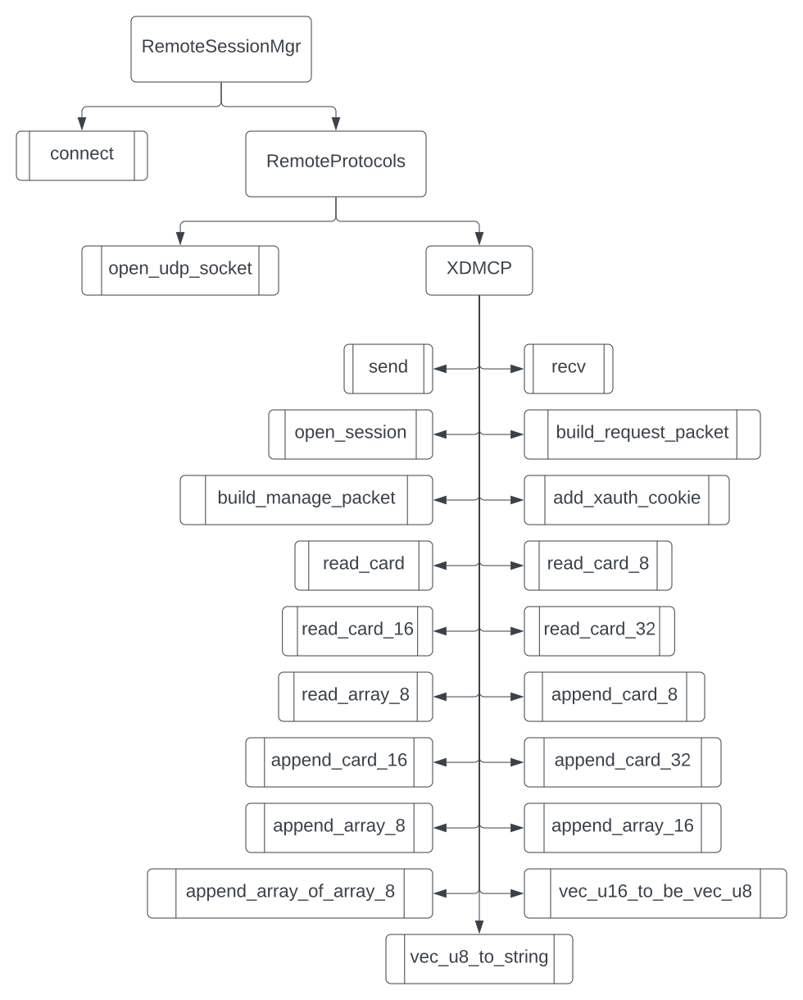

# Rapport du Travail de dîplome
## Résumé / Abstract
Blackrust v0 est un logiciel multiarchitecture pour Linux qui, au lancement de la machine, proposera des sessions d'accès distant utilisant divers protocoles ainsi qu'une session locale hors-ligne.

Ce projet est un client léger qui a pour but de réduire la taille et le coût des moultes machines données aux employés dans une entreprise. Ces clients légers se connecteraient à un serveur central où résideraient les espaces de travail des utilisateurs avec davantage de puissance de calcul.

---

Blackrust v0 is a multi-architecture program for linux that, at the startup of the computer, will offer a remote desktop session via many protocols aswell as an offline local desktop.

This project is a thin client, which aims to reduce the size and cost of the many machines given to employees in a company. These thin clients will connect to a centralized server where the users workspace will be and will offer greater processing power.
## Introduction

## Analyse de l'existant
Il existe déjà plusieurs solutions pour l'accès distant multiprotocole mais la plupart se limitent en termes de disponibilité sur les différentes architectures système ou sont propriétaires / payant.

La valeur ajoutée proposée par ma solution est que ceci est léger, sécurisée, multiplateforme et rapide, permettant de tourner sur des machines avec peu de puissance de processeur, laissant de la puissance pour le décodage du flux vidéo de la session distante afin d'offrir une bonne expérience utilisateur. Ma solution est également open source, gratuit et multiplateforme. Ceci permet l'accès ouvert et de l'extensibilité pour les utilisateurs avec des capacités de développement Rust.

Ce qui distingue Blackrust encore plus des autres prestations est son concept. Les autres applications sont des applications desktop faits pour êtres lancés une fois qu'on est déjà connecté sur une session locale, alors que Blackrust se lance avant la session locale et est un Display Manager / client distant. Cela veut dire que l'utilisateur a la possibilité d'uniquement lancer une ou plusieurs sessions distantes ou locales.

Les solutions suivantes sont la concurrence directe/indirecte dans ce segment du marché:

### [Remmina](https://remmina.org/)
Remmina est un client de desktop remote pour linux écrit en C et qui utilise la librairie GTK+ pour se connecter à plusieurs types de sessions distants tels que  SSH, VNC, RDP, NX, XDMCP, et même des interfaces HTTP/HTTPS qu'on retrouve sur des routeurs.

Ce logiciel remplit le même besoin et on ressemble beaucoup à ce projet, mais il y a une différence principale entre les deux. Blackrust sera disponible dès le lancement du client, et prendra directement en charge le lancement de la session distant ou de la session locale selon le choix de l'utilisateur. Remmina est une application GTK+ qui est lancée sur le bureau donc intrinsèquement utilise plus de ressources que Blackrust.

Ce programme est gratuit, open source et sous la licence Copyleft.

#### Avantages
- Remmina propose les protocoles NX et HTTP/HTTPS en plus de celles de Blackrust
- Système modulaire de plugins pour les protocoles distant
- Interface simple, mais fonctionnel
- Open source

#### Inconvenients
- Doit être lancé depuis le bureau Linux

### [MobaXterm](https://mobaxterm.mobatek.net/)
MobaXTerm est un client d'accès distant (SSH, telnet, rlogin, Mosh, RDP, VNC et XDMCP), terminal avec serveur Xorg intégré, et une compilation d'outils système (CygUtils liste matériel/processus ainsi qu'un package manager) et réseau (Serveurs HTTP/telnet/FTP/NFS/VNC/Cron, tunnels SSH, SSH Keygen, netstat, WakeOnLAN, nmap, CygUtils packet capture).

En plus de tout cela, il propose quelques jeux simples et un éditeur de texte. MobaXterm est un environnement de bureau Linux complet sur Windows et va bien au-delà de la portée de l'accès distant sur la quel Blackrust se concentre.

Il existe une version gratuite pour l'utilisation personnelle ainsi qu'une version payante avec davantage de fonctionnalités pour les utilisateurs professionnels.

Ce programme est propriétaire et distribué sous des licences EULA propres à l'entreprise qui l'a développé, Mobatek.

#### Avantages
- Environnement de bureau Linux complet (accès distant, outils, jeux) sur Windows 
- Système modulaire de plugins pour les outils
- Nombre d'outils convenables pour un utilisateur expérimenté / développeur
- Propriétaire

#### Inconvénients
- Doit être lancé depuis le bureau Windows
- Interface complexe
- Nombre d'outils imposant et possiblement intimidant pour l'utilisateur moyen.

### [ThinLinc](https://www.cendio.com/)
ThinLinc est un environnement d'accès distant complet basé sur le VNC qui utilise l'authentification par tunnel SSH avec les entreprises comme publique cible. 

Ils proposent une solution propriétaire qui utilise des librairies open source, afin d'avoir un système client/serveur pour les clients légers interne, et même du télétravail selon la configuration réseau. Ils font partie de la concurrence à ce projet, car ils se situent dans le même domaine et remplissent le même cas d'utilisation, mais ils proposent un écosystème d'accès distant complet alors que Blackrust est un client polyvalent pour les installations basiques de RDP/VNC/SSH/XDMCP.

### [Citrix](https://www.citrix.com/)
Citrix est un environnement d'accès distant complet basé sur le RDP/RDS qui propose de meilleures performances que le RDP/RDS basique avec les entreprises comme publique cible. 

Ils proposent une solution propriétaire qui utilise des librairies open source, afin d'avoir un système client/serveur pour les clients légers interne, et même du télétravail selon la configuration réseau. Ils font partie de la concurrence à ce projet, car ils se situent dans le même domaine et remplissent le même cas d'utilisation, mais ils proposent un écosystème d'accès distant complet alors que Blackrust est un client polyvalent pour les installations basiques de RDP/VNC/SSH/XDMCP.
## Cahier des charges
[Lien vers le cahier des charges](index.md)
## Analyse fonctionelle
L'analyse fonctionnelle contient les maquettes, l'architecture du programme et les diagrammes explicitant son fonctionnement
### Architecture
#### Modules internes

Le programme est décomposé en 5 modules principaux :

- Main (DM): Point d'entrée du programme et aperçu graphique
- ConfigMgr: CRUD pour les options de connexion sauvegardées
- NetworkMgr: Module qui configure le réseau (IPv4, IPv6, configuration VPN) à travers la commande `nmcli` de [NetworkManager](https://networkmanager.dev/)
- RemoteSessionMgr: Lanceur de sessions distant
    - RemoteProtocols 
        - XDMCP
        - VNC
        - RDP
        - SSH
- BlackrustLib: Fonctions communes à plusieurs modules, librairie interne
##### Main
Le module main est le point d'entrée principale de l'application, lance l'aperçu WebView qui permet d'interfacer avec l'application et appeler les autres modules


###### Fonctions
- ```open_webview```: Instancie et affiche l'interface WebView
- ```combined_html_css_js```: Concaténation des sources HTML, CSS et JS pour le WebView, qui ne prend que de l'HTML
- ```base64_encode_images```: Encode des images en format de données base64, et remplacement des chemins vers les images dans l'HTML avec les données base64
- ```inline_style```: Formate du code CSS en balise ```<style></style>``` HTML
- ```inline_script```: Formate du code JS en balise ```<script></script>``` HTML
###### Tests unitaires
- ```test::open_webview_test```: Test que l'affichage puisse s'instancier et s'afficher, ainsi que la gestion d'erreur de ceci
- ```test::base64_encode_images_test```: Test que l'encodage et remplacement des images dans une balise ```</img>``` fonctionne

##### ConfigMgr
Le module ConfigMgr gère les profils de connexion de session distante avec des fonctions CRUD (Création, Lecture, Mise à Jour, Suppression). Ses fonctionnalités sont appelées depuis le Invoke Handler du WebView et donc depuis le JS de l'interface utilisateur.


###### Fonctions
- ```load_all_profiles```: Instancie tout les profiles depuis des enregistrements dans un fichier .toml
- ```get_profiles```: Récupère tout les profiles de connexion répondant à une requete de recherche
- ```get_profile_by_id```: Récupère un profile de connexion à partir de son identifiant
- ```save_profile```: Sauvegarde un profile modifié
- ```save_profiles```: Sauvegarde tout les profiles dans un fichier .toml
- ```create_profile```: Instancie et sauvegarde une nouvelle profile
- ```delete_profile```: Supprime un profile de connexion 
###### Tests unitaires
##### NetworkMgr
Le module NetworkMgr permet de faire des appels vers NetworkManager pour configurer les interfaces réseau afin de pouvoir se connecter au réseau local et éventuellement à un VPN.


###### Fonctions
- ```get_hostname```: Récupère le nom d'hôte de la machine locale
- ```set_hostname```: Affecte le nom d'hôte de la machine locale
- ```get_all_interfaces```: Récupère les interfaces réseau de la machine locale
- ```get_interface_by_name```: Récupère une interface selon son nom
- ```get_interface_address```: Récupère l'adresse IP d'une interface
- ```load_all_profiles```: Charge tout les profiles réseau depuis l'outil de réseau
- ```get_simple_profile_by_id```: Récupère des informations basiques sur un profile réseau à partir de son identifiant
- ```get_detailed_profile_by_id```: Récupère des informations détaillées sur un profile réseau à partir de son identifiant
- ```create_profile```: Crée un nouveau profile réseau avec l'outil réseau
- ```modify_profile```: Modifie un profile réseau avec l'outil réseau
- ```delete_profile```: Supprime  un profile réseau avec l'outil réseau
- ```exec_command```: Exécute une commande de l'outil réseau
###### Tests unitaires
- ```test::get_hostname_test```: Test que la commande pour récupérer le nom d'hôte est correcte
- ```test::set_hostname_test```: Test que la commande pour affecter le nom d'hôte est correcte
- ```test::get_all_interfaces_test```: Test que la commande pour récuperer les interfaces est correcte
- ```test::get_interface_by_name_test```: Test que la récupération d'interface réussi
- ```test::get_interface_address_test```: Test que la récupération d'adresse réussi
- ```test::load_all_profiles_test```: Test que la récupération de profiles réussi
- ```test::get_simple_profile_by_id_test```: Test que la récupération de profile simple réussi
- ```test::get_detailed_profile_by_id_test```: Test que la récupération de profile détaillée réussi
- ```test::create_profile_test```: Test que la commande pour créer un profile est correcte
- ```test::modify_profile_test```: Test que la commande pour modifier un profile est correcte
- ```test::delete_profile_test```: Test que la commande pour supprimer un profile est correcte
- ```test::exec_command_test```: Test que l'outil réseau puisse accepter des commandes correctement
##### RemoteSessionMgr
Le module RemoteSessionMgr lance les sessions distantes en utilisant les options de connexion soit fournies par l'utilisateur soit par un profile chargé par l'utilisateur. Ce module fait appel aux commandes tel xfreerdp, vncviewer, Xnest ou ssh.


###### Fonctions
- ```connect```: Se connecte à un protocol distant du profile de connexion fourni
- ```remote_protocols::open_udp_socket```: Ouvre un canal de communication UDP entre un serveur distant et la machine actuelle
- ```remote_protocols::xdmcp::send```: Envoi un packet du protocole XDMCP
- ```remote_protocols::xdmcp::recv```: Attends la récéption d'un packet du protocole XDMCP
- ```remote_protocols::xdmcp::open_session```: Négocie une session XDMCP avec un serveur XDMCP distant
- ```remote_protocols::xdmcp::build_request_packet```: Construit un packet de l'opération Request du protocole XDMCP
- ```remote_protocols::xdmcp::build_manage_packet```: Construit un packet de l'opération Manage du protocole XDMCP
- ```remote_protocols::xdmcp::add_xauth_cookie```: Ajoute un cookie d'authentification MIT_MAGIC_COOKIE-1 au XAuthority du système
- ```remote_protocols::xdmcp::read_card```: Lit un nombre de bytes d'un buffer à un offset donné depuis le buffer
- ```remote_protocols::xdmcp::read_card_8```: Lit une valeur de taille 1 byte à un offset donné depuis le buffer
- ```remote_protocols::xdmcp::read_card_16```: Lit une valeur de taille 2 bytes à un offset donné depuis le buffer
- ```remote_protocols::xdmcp::read_card_32```: Lit une valeur de taille 4 bytes à un offset donné depuis le buffer
- ```remote_protocols::xdmcp::read_array_8```: Lit un array de valeurs 1 byte de taille variable à un offset donné depuis le buffer
- ```remote_protocols::xdmcp::append_card_8```: Ajoute une valeur de taille 1 byte à la fin du buffer
- ```remote_protocols::xdmcp::append_card_16```: Ajoute une valeur de taille 2 bytes à la fin du buffer
- ```remote_protocols::xdmcp::append_card_32```: Ajoute une valeur de taille 4 bytes à la fin du buffer
- ```remote_protocols::xdmcp::append_array_8```: Ajoute une array de valeurs 1 byte de taille variable à la fin du buffer
- ```remote_protocols::xdmcp::append_array_16```: Ajoute une array de valeurs 2 bytes de taille variable à la fin du buffer
- ```remote_protocols::xdmcp::append_array_of_array_8```
- ```remote_protocols::xdmcp::vec_u16_to_be_vec_u8```
- ```remote_protocols::xdmcp::vec_u8_to_string```
###### Tests unitaires
##### Blackrust-Lib
Blackrust-Lib est la libraire commune aux modules et contient les définitions de structures de données et les fonctions utilisées par tous les modules.

#### Librairies externes
Le programme utilise également quelques libraires externes, principalement pour le rendu graphique Web.
##### Web-view
Web-view est un crate qui agit en tant que navigateur web qui affiche le rendu HTML/CSS/JS.
##### Xrandr
Xrandr permet de récupérer des informations sur le ou les écrans d'affichage, comme taille, DPI, disposition des moniteurs, etc.
##### Serde / Serde-JSON
Serde implémente des fonctionnalités de sérialisation et désérialisation des instances d'objets vers et depuis le JavaScript Object Notation (JSON).
##### Image-base64
Image-base64 est un crate qui encode ou "traduit" des fichiers image en texte base64. **Ceci est nécessaire pour l'instant à cause de WebView qui ne peut pas référencer des fichiers et que traiter du HTML pur. Ceci pourra changer en implémentant Actix (Serveur Web) et Yew (Framework WASM pour Rust)**
##### Regex
Le crate Regex implémente des expressions régulières utilisées pour la vérification des données saisies par l'utilisateur pour la configuration réseau
##### TOML
Le crate TOML est un sérialiseur/déserialiseur des format
##### Itertools
##### Dirs
##### RSTest
##### MockAll
### Maquettes

## Sécurité
De base Rust est conçu pour être une langue très sécurisée, mais il existe toujours la possibilité des failles dans le programme et le périphérique du programme. Dans cette rubrique, je vais mentionner les risques de sécurité identifiés et des mitigations possibles.
### Failles possibles
#### Fuite d'accès/tokens dans un commit
Github secrets
## Data flow diagram

## Analyse organique
### Choix du langage
J'ai choisi Rust comme langage pour le travail de semestre, car c'est un langage moderne. Rust est connu pour sa fiabilité, sécurité et rapidité.

#### Rapidité
Rust est connu pour sa rapidité grâce à certains caractéristiques :
- Rust est statiquement typé, donc après la vérification de cargo check, pleins de vérifications au runtime peuvent être sautées
- Rust n'as pas de Garbage Collector, la mémoire est alloué et libéré selon "l'espérance de vie" d'une variable et donc ces derniers n'existent aussi longtemps que nécessaire. Ceci réduit les ressources consommées par un Garbage Collector et enlève les tâches répétitives de gérance de mémoire manuelle
- Rust utilise le LLVM pour générer du code assembly optimisé, qui est comparable au GCC en termes de performances du programme final
#### Compilateur
L'outil de compilation de Rust, nommée cargo, a plusieurs rôles :
- Package manager, pour les "crates" qui sont les paquets/modules officiels et de la communauté
- Validateur du code, cargo check vérifie plusieurs aspects avant de compiler le programme :
    - Que la gérance du mémoire est bien fait et ne viole pas les règles d'appartenance ou d'emprunt de références
    - Que les variables sont nommées en snake case, sinon il affiche des warnings
    - Qu'il n'y a pas du code "mort", donc pas utilisé, sinon il affiche des warnings
- Compilateur, bien entendu si le code ne contient pas d'erreur de syntaxe, ni de gérance de mémoire le programme est compilée et rends un exécutable dans le dossier target

Les messages d'erreurs de cargo sont assez riches comparés aux autres langages. Cargo peut décrire l'erreur détectée en détail et même selon le type d'erreur, il peut suggérer des solutions. Si cela ne suffit pas, le traçage de la pile d'appels est accessible et peut aider avec le débogage traditionnel.
#### Sécurité / Fiabilité
De base, le langage Rust est assez sécure et fiable grâce aux faites suivantes :
- Rust est "memory-safe", qui signifie qu'il ne permet pas d'avoir des pointeurs null ou invalide
- Les courses de données sont également impossible, grâce au système de "appartenance", qui impose qu'une instance ou référence variable ne peut être utilisé par une fonction à la fois.
- La gestion d'erreur est très avancé et devrait être au cœur de la conception d'une fonction. Cette approche permet d'être toujours certain que le déroulement se passe comme prévu et les cas de bords qui pourraient compromettre la sécurité de l'application sont évités.
- Fonctionnalités de tests unitaires intégrées

#### Tests unitaires
Rust contient une suite de tests unitaires permettant de fiabiliser le développement continu. Les tests sont des fonctions marquées avec un flag ```#[test] ``` et exécutées avec l'outil interne ```cargo test```.

#### Multi-plateforme
Rust est un langage avec un compilateur portable comme le langage C, donc qui peut être compilé sur la plupart des plateformes avec certaines garanties de fonctionnalité. Rust catégorise ces garanties dans un système de tiers. Les tiers sont ainsi :

- Tier 1: Garantie d'exécution, un programme en Rust pure est capable de compiler et de s'exécuter sans problèmes
    - Exemples : x86_64 Windows, x86_64 MacOS, x86_64 Linux, AArch64 Linux (ARM64)
- Tier 2: Garantie de compiler, un programme en Rust pure est capable d'être compilé, mais n'as pas une garantie 100% de fonctionner parfaitement lors de l'éxécution
    - Exemples: iOS, Android, RISC-V, MIPS/MIPS64, PowerPC/PowerPC64 
- Tier 3: Pas de garanties de compilation ni d'exécution, mais ont une possibilité de fonctionner et pour certains des programmes ont déjà été faites
    - Exemples : Apple tvOS, Nintendo 3DS, CUDA, EFI

### Normes
#### Nommage
##### Rust
Rust impose le snake case (exemple_nom) pour les noms des fonctions et des variables et pascal case (ExempleNom) pour le nom des objets.
##### JS/HTML
Pour le JS et HTML j'ai choisi d'utiliser le camel case (exempleNom) pour les variables, noms des fonctions et nommage des composants HTML
#### Commentaires Rust/JS
Les fichiers ont comme entête le suivant :
```
/** File
 * Author:		Dylan Upchurch
 * Date:		2022-01-01
 * Desc:		File purpose
 */ 
```
##### Rust
Les fonctions sont précédées par un entête comme le suivant :
```
/** Function
 * Name:	fn_name
 * Purpose:	Ce que fait la fonction
 * Args:	(Type) nom_arg: Description argument
 * Returns: (Type) Description valeur de retour
 */
```

Les structs sont précédés par un entête comme le suivant :
```
/** Struct
     * Name:	     StructName
     * Purpose:      A quoi sert le struct
     * Properties:   (Type) nom: Description propriété
     */
```

Les enums sont précédés par un entête comme le suivant :
```
/** Enum
 * Name:    NomEnum
 * Members: NomMembre: Description du membre
 */
```
 #### JS
Les fonctions sont précédées par un entête comme le suivant :
```
/** Function
 * Name:	functionName
 * Purpose:	Ce que fait la fonction
 * Args:	nom_arg: Description argument
 * Returns: (Type) Description valeur de retour
 */
```

#### Commits
Les messages de commits n'ont pas de norme spéciale, le seul forme respectée s'agit d'un commentaire descriptif bref en anglais qui explique ce que contient le commit. Les différentes actions sont séparées par des virgules. Exemple de message de commit : ("Added functionnality X, removed unused code")

### Organisation
La gestion du projet se fait avec l'outil YouTrack. Ce dernier propose des fonctionnalités Gantt, Kanban, relevée d'horaires et de génération de rapports sur ces derniers. 
### Environnement de travail
L'environnement de travail utilisé lors du développement de ce projet consistes-en :

#### Matériel
- Ordinateur de l'école "upchr-arch"
- Raspberry Pi Model 4B (4GB) "Testbed-Rpi"
- Jetson Nano Developer Kit "Testbed-JN"
#### Software
##### Arch Linux (upchr-arch)
- Visual Studio Code
- Rust "Stable"
##### Raspbian / Debian 11 Bullseye (Testbed-Rpi)
- Blackrust
##### Arch Linux (Testbed-Rpi)
- Blackrust
##### Linux4Tegra (Testbed-JN)
- Blackrust

## Difficultés rencontrées
### Installation de la sous dépendance keyboard-config interrompait l'installation de dépendances dans un runner Github Actions CI
Lors de l'installation du paquet ```xserver-xorg```, la dépendance de ce dernier ```keyboard-config``` demande un saisi utilisateur qui ne peut pas être effectué dans l'exécution automatique du script de test. Donc la solution pour cela est d'exporter une variable d'environnement lors de l'installation des dépendances, ```sudo DEBIAN_FRONTEND=noninteractive apt-get -y install ...```. Ceci force keyboard-config à prendre une valeur par défaut et laisser le reste de l'installation se poursuivre.
### Tests unitaires utilisant le serveur d'affichage ne réusissent pas sur Github Actions CI
Pour certains tests unitaires, un serveur d'affichage X.Org est nécessaire mais, cela n'est pas installé dans les containeurs de runner Github Actions CI. Donc la solution pour cela est d'installer les paquets ```xserver-xorg``` et ```xserver-xorg-video-dummy```. Ceci permet de faire un serveur X11 en mode headless afin de valider que le programme s'exécute et affiche l'interface WebView. Afin de spécifier le fait que nous voulons utiliser le driver ```xserver-xorg-video-dummy```, nous devons créer un fichier de configuration comme la suivante et exécuter ```X :0 -config .github/workflows/xorg-dummy.conf &``` à la racine du projet :

```conf
# Source: https://techoverflow.net/2019/02/23/how-to-run-x-server-using-xserver-xorg-video-dummy-driver-on-ubuntu/
Section "Monitor"
  Identifier "Monitor0"
  HorizSync 28.0-80.0
  VertRefresh 48.0-75.0
  # https://arachnoid.com/modelines/
  # 1920x1080 @ 60.00 Hz (GTF) hsync: 67.08 kHz; pclk: 172.80 MHz
  Modeline "1920x1080_60.00" 172.80 1920 2040 2248 2576 1080 1081 1084 1118 -HSync +Vsync
EndSection

Section "Device"
  Identifier "Card0"
  Driver "dummy"
  VideoRam 256000
EndSection

Section "Screen"
  DefaultDepth 24
  Identifier "Screen0"
  Device "Card0"
  Monitor "Monitor0"
  SubSection "Display"
    Depth 24
    Modes "1920x1080_60.00"
  EndSubSection
EndSection
```
### Échec du test unitaire open_webview_test causée par la récupération de nom d'hôte
Lors du test unitaire open_webview_test qui vérifie que le WebView peut être construit et affiché dans le serveur d'affichage, la récupération du nom d'hôte provoque un SIGABRT (process abort signal) alors que le test s'est bien effectué. Ceci est le cas car, le test ferme l'application juste après que l'appel est fait et en conséquence fait une erreur quand il ne peut pas exécuter le code JS permettant d'afficher le résultat. La solution à ce problème et de déplacer l'appel vers network_mgr pour récupérer le nom d'hôte dans le invoke "init" du WebView afin de retarder l'appel et ne pas provoquer d'appels qui ne pourront pas être aboutis.
## Tests
### Tests unitaires
Rust propose des tests unitaires prallèlisés intégré dans les outils de base. L'outil en ligne de commande est ```cargo test```. De plus, les tests peuvent être étendus avec des crates prévu à cet effet comme rstest ou mockall, qui sont des crates qui proposent des tests data-driven et du mocking automatique pour des traits/structs. 

Les tests sont exécutés lors du développement sur la machine locale, ainsi que sur Github grâce à Github Actions à chaque push vers le repo. Les tests de Github Actions sont exécutés dans un containeur sain ou les étapes de setup nécessaire sont refait à chaque push pour s'assurer que le build peut être déployé et utilisé sur un système vièrge et qu'il n'y a pas de problèmes d'état entre deux builds liée à la machine de test.
#### Périmètre des tests
Les scénarios suivants sont testés :

- Les paniques
- Lancement du WebView
- La génération de la page web réussit
- Que la génération de profile se crée, lit, modifie, et supprime
- Que la génération de configuration réseau se crée, lit, modifie et supprime
- Que l'envoi et la réception de packet TCP/UDP s'effectue

##### Format description des tests
Le format choisi pour décrire les tests unitaires est le suivant :
```md
###### fn_name_test
| Propriété | Valeur |
|-|-|
| **Nom** | ```fn_name_test``` |
| **Nom de la fonction testée** | ```fn_name``` |
| **Description de la fonction testée** | A quoi sert la fonction testée |
| **Fichier** | ```file.rs``` |
| **Cas *n*** ||
| *Description* | Description du cas testée |
| *Type de résultat attendu* | Réussite/Échec |
| *Critère(s) d'acceptation* ||
| *Critère(s) d'échec* ||
```
Ce qui donne le rendu suivant :
###### fn_name_test
| Propriété | Valeur |
|-|-|
| **Nom** | ```fn_name_test``` |
| **Nom de la fonction testée** | ```fn_name``` |
| **Description de la fonction testée** | A quoi sert la fonction testée |
| **Fichier** | ```file.rs``` |
| **Cas *n*** ||
| *Description* | Description du cas testée |
| *Type de résultat attendu* | Réussite/Échec |
| *Critère(s) d'acceptation* ||
| *Critère(s) d'échec* ||

##### Description des tests
###### open_webview_test
| Propriété | Valeur |
|-|-|
| **Nom** | ```open_webview_test``` |
| **Nom de la fonction testée** | ```open_webview``` |
| **Description de la fonction testée** | La fonction ```open_webview``` sert à instancier et lancer l'interface WebView depuis les sources HTML/CSS/JS. |
| **Fichier** | ```dm.rs``` |
| **Cas 1** ||
| *Description* | Cas qui assure que la construction et affichage de l'interface WebView est réussi |
| *Type de résultat attendu* | Réussite |
| *Critère(s) d'acceptation* | Valeur de type Ok est émis par open_webview qui indique que l'objet s'est bien instanciée |
|| Le WebView se lance dans le serveur Xorg headless (mock d'interface/dummy)|
| *Critère(s) d'échec* | Valeur de type Err est émis par open_webview avec un message d'erreur qui indique que l'objet s'est bien instanciée |
|| Le WebView lance une exception indiquant qu'il n'a pas pu se lancer dans le serveur Xorg headless (mock d'interface/dummy) |

###### base64_encode_images_test
| Propriété | Valeur |
|-|-|
| **Nom** | ```base64_encode_images_test``` |
| **Nom de la fonction testée** | ```base64_encode_images``` |
| **Description de la fonction testée** | La fonction ```base64_encode_images``` utilise une expression régulière (RegEx) dans un premier temps pour détecter des balises `````` avec un attribut ```src``` qui a comme valeur un chemin vers une image. Dans un deuxième temps, la fonction lit l'image et l'encode en format de chaîne de caractères base64, puis remplace le chemin avec la chaîne base64 avec la même expression régulière afin d'inclure l'image directement dans la page HTML. |
| **Fichier** | ```dm.rs``` |
| **Cas 1** ||
| *Description* | Cas qui assure que la détection de balise, l'encodage d'image exemple de taille 8 pixel x 8 pixels et finalement le replacement de la valeur de l'attribut ```src``` sont réussis |
| *Type de résultat attendu* | Réussite |
| *Critère(s) d'acceptation* | String contenant le HTML encodé émis et conforme au résultat attendu |
| *Critère(s) d'échec* | String contenant le HTML encodé émis mais, non conforme au résultat attendu |
|| Panique de la fonction base64_encode_images |

###### exec_command_test
| Propriété | Valeur |
|-|-|
| **Nom** | ```exec_command_test``` |
| **Nom de la fonction testée** | ```exec_command``` |
| **Description de la fonction testée** | La fonction ```exec_command```, provenant du trait NetworkTool, exécute une commande shell avec les arguments fournis pour l'outil implémentée (dans ce cas ```nmcli``` de NetworkManager) et rend soit le stdout en valeur de type Ok(String) ou le stderr en valeur de type Err(String). |
| **Fichier** | ```network_mgr.rs``` |
| **Cas 1** ||
| *Description* | Cas qui assure que la commande ```nmcli``` avec les arguments ```connection show``` rends une valeur de type Ok(String). Ceci vérifie qu'une commande valide émets une valeur Ok avec le stdout de la commande. |
| *Type de résultat attendu* | Réussite |
| *Critère(s) d'acceptation* | Valeur de type Ok(String) avec stdout comme contenu émis |
| *Critère(s) d'échec* | Valeur de type Err(String) avec stderr comme contenu émis |
| **Cas 2** ||
| *Description* | Cas qui assure que la commande ```nmcli``` avec les arguments ```show``` rends une valeur de type Ok(String). Ceci vérifie qu'une commande invalide émets une valeur Err avec le stderr de la commande. |
| *Type de résultat attendu* | Échec |
| *Critère(s) d'acceptation* | Valeur de type Err(String) avec stderr comme contenu est émis |
| *Critère(s) d'échec* | Valeur de type Ok(String) avec stdout comme contenu est émis |

###### get_hostname_test
| Propriété | Valeur |
|-|-|
| **Nom** | ```get_hostname_test``` |
| **Nom de la fonction testée** | ```get_hostname``` |
| **Description de la fonction testée** | La fonction ```get_hostname``` utilise le NetworkTool fourni pour récupérer le nom d'hôte de la machine. |
| **Fichier** | ```network_mgr.rs``` |
| **Cas 1** ||
| *Description* | Cas qui assure avec un MockNetworkTool que la récupération du nom d'hôte de la machine réussi |
| *Type de résultat attendu* | Réussite |
| *Critère(s) d'acceptation* | Valeur de type Ok(String) contenant le nom d'hôte est émis |
| *Critère(s) d'échec* | Valeur de type Err(String) contenant un message d'erreur est émis |
| **Cas 2** ||
| *Description* | Cas qui assure avec un MockNetworkTool que la gestion d'erreur fonctionne. Ceci est dans le cas que la commande exécutée émet une erreur |
| *Type de résultat attendu* | Échec |
| *Critère(s) d'acceptation* | Valeur de type Err(String) contenant un message d'erreur est émis |
| *Critère(s) d'échec* | Valeur de type Ok(String) contenant le nom d'hôte est émis |

###### set_hostname_test
| Propriété | Valeur |
|-|-|
| **Nom** | ```set_hostname_test``` |
| **Nom de la fonction testée** | ```set_hostname``` |
| **Description de la fonction testée** | La fonction ```set_hostname``` utilise le NetworkTool fourni pour affecter le nom d'hôte de la machine |
| **Fichier** | ```network_mgr.rs``` |
| **Cas 1** ||
| *Description* | Cas qui assure avec un MockNetworkTool que l'affectation de nom d'hôte réussi. |
| *Type de résultat attendu* | Réussite |
| *Critère(s) d'acceptation* | Valeur de type Ok(String) émis |
| *Critère(s) d'échec* | Valeur de type Err(String) contenant un message d'erreur est émis |
| **Cas 2** ||
| *Description* | Cas qui assure avec un MockNetworkTool que la gestion d'erreur fonctionne. Ceci est dans le cas que la commande exécutée émet une erreur. |
| *Type de résultat attendu* | Échec |
| *Critère(s) d'acceptation* | Valeur de type Err(String) contenant un message d'erreur est émis |
| *Critère(s) d'échec* | Valeur de type Ok(String) émis |

###### get_all_interfaces_test
| Propriété | Valeur |
|-|-|
| **Nom** | ```get_all_interfaces_test``` |
| **Nom de la fonction testée** | ```get_all_interfaces``` |
| **Description de la fonction testée** | La fonction ```get_all_interfaces``` utilise le NetworkTool fourni pour récuperer les interfaces réseau de la machine |
| **Fichier** | ```network_mgr.rs``` |
| **Cas 1** ||
| *Description* | Cas qui assure avec un MockNetworkTool que la récupération de la liste d'interfaces réseau réussi |
| *Type de résultat attendu* | Réussite |
| *Critère(s) d'acceptation* | Valeur de type Ok(Vec<Interface\>) non-vide émis |
| *Critère(s) d'échec* | Valeur de type Err(String) contenant un message d'erreur est émis |
| **Cas 2** ||
| *Description* | Cas qui assure avec un MockNetworkTool que la gestion d'erreur fonctionne. Ceci est dans le cas que la commande exécutée émet une erreur. |
| *Type de résultat attendu* | Échec |
| *Critère(s) d'acceptation* | Valeur de type Err(String) contenant un message d'erreur est émis |
| *Critère(s) d'échec* | Valeur de type Ok(Vec<Interface\>) émis |

###### get_interface_by_name_test
| Propriété | Valeur |
|-|-|
| **Nom** | ```get_interface_by_name_test``` |
| **Nom de la fonction testée** | ```get_interface_by_name``` |
| **Description de la fonction testée** | La fonction ```get_interface_by_name``` utilise le NetworkTool fourni pour récuperer une interface réseau de la machine depuis son nom |
| **Fichier** | ```network_mgr.rs``` |
| **Cas 1** ||
| *Description* | Cas qui assure avec un MockNetworkTool que la récupération d'une interface mock loopback fonctionne |
| *Type de résultat attendu* | Réussite |
| *Critère(s) d'acceptation* | Valeur de type Some(Interface) contenant une interface avec les propriétés renseignées est émis |
| *Critère(s) d'échec* | Valeur de type None est émis |
| **Cas 2** ||
| *Description* | Cas qui assure avec un MockNetworkTool que dans la possibilité ou il n'y a pas d'interface assignée à un profile, la valeur None est émis |
| *Type de résultat attendu* | Échec |
| *Critère(s) d'acceptation* | Valeur de type None est émis |
| *Critère(s) d'échec* | Valeur de type Some est émis |
| **Cas 3** ||
| *Description* | Cas qui assure avec un MockNetworkTool que si l'interface avec le nom donnée n'existe pas, la valeur None est émis |
| *Type de résultat attendu* | Échec |
| *Critère(s) d'acceptation* | Valeur de type None est émis |
| *Critère(s) d'échec* | Valeur de type Some est émis |

###### load_all_profiles_test
| Propriété | Valeur |
|-|-|
| **Nom** | ```load_all_profiles_test``` |
| **Nom de la fonction testée** | ```load_all_profiles``` |
| **Description de la fonction testée** | La fonction ```load_all_profiles``` charge et instancie tout les profiles de connexion stockées par le NetworkTool fourni |
| **Fichier** | ```network_mgr.rs``` |
| **Cas 1** ||
| *Description* | Cas qui assure avec un MockNetworkTool que la récupération de profile fonctionne |
| *Type de résultat attendu* | Réussite |
| *Critère(s) d'acceptation* | Valeur de type Ok(Vec<Interface\>) contenant un profile avec les propriétés renseignées est émis|
| *Critère(s) d'échec* | Valeur de type Err(String) contenant un message d'erreur est émis |
| **Cas 2** ||
| *Description* | Cas qui assure avec un MockNetworkTool que la gestion d'erreur fonctionne. Ceci est dans le cas que la commande exécutée émet une erreur. |
| *Type de résultat attendu* | Échec |
| *Critère(s) d'acceptation* | Valeur de type Err(String) contenant un message d'erreur est émis |
| *Critère(s) d'échec* |Valeur de type Ok(Vec<Interface\>) est émis |

###### create_profile_test
| Propriété | Valeur |
|-|-|
| **Nom** | ```create_profile_test``` |
| **Nom de la fonction testée** | ```create_profile``` |
| **Description de la fonction testée** | La fonction ```create_profile``` crée un profile de connexion réseau avec le NetworkTool fourni. |
| **Fichier** | ```network_mgr.rs``` |
| **Cas 1** ||
| *Description* | Cas qui assure avec un MockNetworkTool que la création de profile de connexion réseau fonctionne. |
| *Type de résultat attendu* | Réussite |
| *Critère(s) d'acceptation* | Valeur de type Ok(String) contenant l'identifiant du nouveau profile est émis |
| *Critère(s) d'échec* | Valeur de type Err(String) contenant un message d'erreur est émis |
| **Cas 2** ||
| *Description* | Cas qui assure avec un MockNetworkTool que la gestion d'erreur fonctionne. Ceci est dans le cas que la commande exécutée émet une erreur. |
| *Type de résultat attendu* | Échec |
| *Critère(s) d'acceptation* | Valeur de type Err(String) contenant un message d'erreur est émis |
| *Critère(s) d'échec* | Valeur de type Ok(String) est émis|

###### get_simple_profile_by_id_test
| Propriété | Valeur |
|-|-|
| **Nom** | ```get_simple_profile_by_id_test``` |
| **Nom de la fonction testée** | ```get_simple_profile_by_id``` |
| **Description de la fonction testée** | La fonction ```get_simple_profile_by_id``` récupère un profile avec des informations basiques par son identifiant unique. |
| **Fichier** | ```network_mgr.rs``` |
| **Cas 1** ||
| *Description* | Cas qui assure avec un MockNetworkTool que la récupération des informations basique depuis un identifiant fonctionne. |
| *Type de résultat attendu* | Réussite |
| *Critère(s) d'acceptation* | Valeur de type Ok(NetworkManagerProfile) contenant le profile demandée est émis |
| *Critère(s) d'échec* | Valeur de type Err(String) contenant un message d'erreur est émis  |
| **Cas 2** ||
| *Description* | Cas qui assure avec un MockNetworkTool que la gestion d'erreur fonctionne. Ceci est dans le cas que la commande exécutée émet une erreur ou que le profile demandée n'a pas été trouvée.  |
| *Type de résultat attendu* | Échec |
| *Critère(s) d'acceptation* | Valeur de type Err(String) contenant un message d'erreur est émis |
| *Critère(s) d'échec* | Valeur de type Ok(NetworkManagerProfile) est émis |

###### get_detailed_profile_by_id_test
| Propriété | Valeur |
|-|-|
| **Nom** | ```get_detailed_profile_by_id_test``` |
| **Nom de la fonction testée** | ```get_detailed_profile_by_id``` |
| **Description de la fonction testée** | La fonction ```get_detailed_profile_by_id``` récupère un profile avec des informations détaillées par son identifiant unique. |
| **Fichier** | ```network_mgr.rs``` |
| **Cas 1** ||
| *Description* | Cas qui assure avec un MockNetworkTool que la récupération des informations détaillées depuis un identifiant fonctionne. |
| *Type de résultat attendu* | Réussite |
| *Critère(s) d'acceptation* | Valeur de type Ok(NetworkManagerProfile) contenant le profile demandée est émis |
| *Critère(s) d'échec* | Valeur de type Err(String) contenant un message d'erreur est émis |
| **Cas 2** ||
| *Description* | Cas qui assure avec un MockNetworkTool que la gestion d'erreur fonctionne. Ceci est dans le cas que la commande exécutée émet une erreur ou que le profile demandée n'a pas été trouvée. |
| *Type de résultat attendu* | Échec |
| *Critère(s) d'acceptation* | Valeur de type Err(String) contenant un message d'erreur est émis |
| *Critère(s) d'échec* | Valeur de type Ok(NetworkManagerProfile) est émis |

###### modify_profile_test
| Propriété | Valeur |
|-|-|
| **Nom** | ```modify_profile_test``` |
| **Nom de la fonction testée** | ```modify_profile``` |
| **Description de la fonction testée** | La fonction ```modify_profile``` modifie un profile avec le NetworkTool fourni. |
| **Fichier** | ```network_mgr.rs``` |
| **Cas *n*** ||
| *Description* | Description du cas testée |
| *Type de résultat attendu* | Réussite/Échec |
| *Critère(s) d'acceptation* ||
| *Critère(s) d'échec* ||

###### delete_profile_test
| Propriété | Valeur |
|-|-|
| **Nom** | ```delete_profile_test``` |
| **Nom de la fonction testée** | ```delete_profile``` |
| **Description de la fonction testée** | La fonction ```delete_profile``` supprime un profile avec le NetworkTool fourni. |
| **Fichier** | ```network_mgr.rs``` |
| **Cas 1** ||
| *Description* | Cas qui assure avec un MockNetworkTool que la suppresion d'un profile fonctionne.  |
| *Type de résultat attendu* | Réussite |
| *Critère(s) d'acceptation* | Valeur de type Ok(()) est émis |
| *Critère(s) d'échec* | Valeur de type Err(String) contenant un message d'erreur est émis |
| **Cas 1** ||
| *Description* | Cas qui assure avec un MockNetworkTool que la gestion d'erreur fonctionne. Ceci est dans le cas que la commande exectuée émet une erreur. |
| *Type de résultat attendu* | Échec |
| *Critère(s) d'acceptation* | Valeur de type Err(String) contenant un message d'erreur est émis  |
| *Critère(s) d'échec* | Valeur de type Ok(()) est émis |

### Tests de compatibilité hardware (Intégration)
Les tests d'intégration hardware servent à informer la portée possible de déploiement du programme. Rust est conçu pour être multiplateforme, mais il y a certaines dépendances qui auront besoin d'être vérifiées avant d'être sûr de la compatibilité avec les architectures système visées.
#### Procédure définit
1. Installer Blackrust et ses dépendances
2. Lancer Blackrust
3. Observer des possibles délais/lag avec l'interface WebView/WebAssembly
4. Lancer une session d'accès distant avec RDP, XDMCP et VNC
5. Observer délais/lag avec session d'accès distant

## Planning
### Prévisionnel
Le planning prévisionnel a été établi avec la fonctionnalité Gantt de l'outil YouTrack que j'utilise pour la gestion du projet. J'ai choisi de faire avec cet outil car, je peux générer de divers types de rapports sur les tâches accomplies et le temps que ces derniers ont pris.

### Effectif

## Livrables
- Documentation
    - Cahier des charges
    - Journal de bord
    - Documentation technique
    - Manuel utilisateur
- Programme
    - Paquet avec scripts d'installation (PKGBUILD)
    - Code source ([Github](https://github.com/DylanUpchr/Blackrust))
## Conclusion
## Bilan Personnel