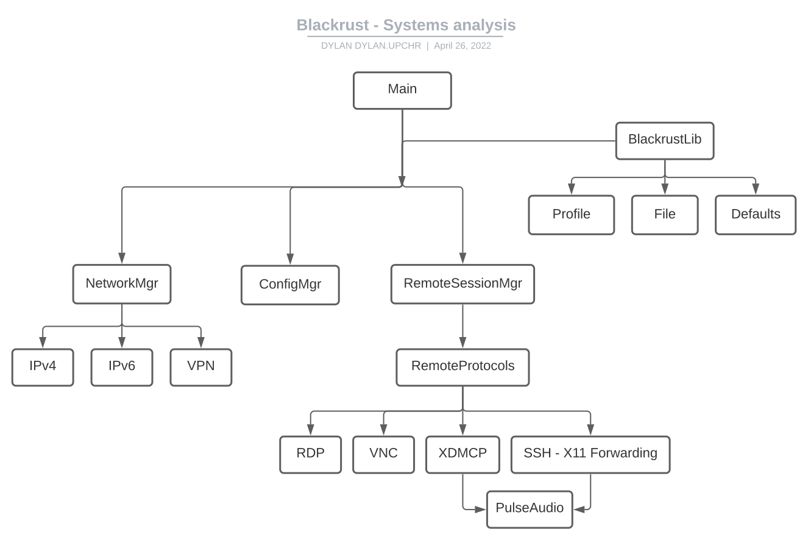

# Rapport du Travail de semestre
## Résumé / Abstract
Blackrust v0 est un logiciel multiplateforme pour Linux qui, au lancement de la machine, proposera des sessions d'accès distant utilisant divers protocoles ainsi qu'une session locale hors-ligne.

Ce projet est un client léger qui a pour but de réduire la taille et le coût des moultes machines données aux employés dans une entreprise. Ces clients légers se connecteraient à un serveur central où résideraient les espaces de travail des utilisateurs avec davantage de puissance de calcul.

---

Blackrust v0 is a multiplatform program for linux that, at the startup of the computer, will offer a remote desktop session via many protocols aswell as an offline local desktop.

This project is a thin client, which aims to reduce the size and cost of the many machines given to employees in a company. These thin clients will connect to a centralized server where the users workspace will be and will offer greater processing power.

## Analyse de l'existant
Il existe déjà plusieurs solutions pour l'accès distant multiprotocole mais la plupart se limitent en termes de disponibilité sur les différentes architectures système ou sont propriétaires / payant.

Blackrust répond aux solutions suivantes en étant Open source, gratuit, multiprotocole et multiplateforme.

### [Remmina](https://remmina.org/)
Remmina est un client de desktop remote pour linux écrit en C et qui utilise la librairie GTK+ pour se connecter à plusieurs types de sessions distants tels que  SSH, VNC, RDP, NX, XDMCP, et même des interfaces HTTP/HTTPS qu'on retrouve sur des routeurs.

Ce logiciel remplit le même besoin et on ressemble beaucoup à ce projet, mais il y a une différence principale entre les deux. Blackrust sera disponible dès le lancement du client, et prendra directement en charge le lancement de la session distant ou de la session locale selon le choix de l'utilisateur. Remmina est une application GTK+ qui est lancée sur le bureau donc intrinsèquement utilise plus de ressources que Blackrust.

Ce programme est gratuit, open source et sous la licence Copyleft.

#### Avantages
- Remmina propose les protocoles NX et HTTP/HTTPS en plus de celles de Blackrust
- Système modulaire de plugins pour les protocoles distant
- Interface simple, mais fonctionnel
- Open source

#### Inconvenients
- Doit être lancé depuis le bureau Linux

### [MobaXterm](https://mobaxterm.mobatek.net/)
MobaXTerm est un client d'accès distant (SSH, telnet, rlogin, Mosh, RDP, VNC et XDMCP), terminal avec serveur Xorg intégré, et une compilation d'outils système (CygUtils liste matériel/processus ainsi qu'un package manager) et réseau (Serveurs HTTP/telnet/FTP/NFS/VNC/Cron, tunnels SSH, SSH Keygen, netstat, WakeOnLAN, nmap, CygUtils packet capture).

En plus de tout cela, il propose quelques jeux simples et un éditeur de texte. MobaXterm est un environnement de bureau Linux complet sur Windows et va bien au-delà de la portée de l'accès distant sur la quel Blackrust se concentre.

Il existe une version gratuite pour l'utilisation personnelle ainsi qu'une version payante avec davantage de fonctionnalités pour les utilisateurs professionnels.

Ce programme est propriétaire et distribué sous des licences EULA propres à l'entreprise qui l'a développé, Mobatek.

#### Avantages
- Environnement de bureau Linux complet (accès distant, outils, jeux) sur Windows 
- Système modulaire de plugins pour les outils
- Nombre d'outils convenables pour un utilisateur expérimenté / développeur
- Propriétaire

#### Inconvénients
- Doit être lancé depuis le bureau Windows
- Interface complexe
- Nombre d'outils imposant et possiblement intimidant pour l'utilisateur moyen.

### [ThinLinc](https://www.cendio.com/)
ThinLinc est un environnement d'accès distant complet basé sur le VNC qui utilise l'authentification par tunnel SSH avec les entreprises comme publique cible. 

Ils proposent une solution propriétaire qui utilise des librairies open source, afin d'avoir un système client/serveur pour les clients légers interne, et même du télétravail selon la configuration réseau. Ils font partie de la concurrence à ce projet, car ils se situent dans le même domaine et remplissent le même cas d'utilisation, mais ils proposent un écosystème d'accès distant complet alors que Blackrust est un client polyvalent pour les installations basiques de RDP/VNC/SSH/XDMCP.

### [Citrix](https://www.citrix.com/)
Citrix est un environnement d'accès distant complet basé sur le RDP/RDS qui propose de meilleures performances que le RDP/RDS basique avec les entreprises comme publique cible. 

Ils proposent une solution propriétaire qui utilise des librairies open source, afin d'avoir un système client/serveur pour les clients légers interne, et même du télétravail selon la configuration réseau. Ils font partie de la concurrence à ce projet, car ils se situent dans le même domaine et remplissent le même cas d'utilisation, mais ils proposent un écosystème d'accès distant complet alors que Blackrust est un client polyvalent pour les installations basiques de RDP/VNC/SSH/XDMCP.

## Cahier des charges
[Lien vers le cahier des charges](index.md)
## Analyse fonctionnelle
L'analyse fonctionnelle contient les maquettes, l'architecture du programme et les diagrammes explicitant son fonctionnement
### Architecture
#### Modules internes

Le programme est décomposé en 5 modules principaux :

##### Main (DM): Point d'entrée du programme et aperçu graphique
##### ConfigMgr: CRUD pour les options de connexion sauvegardées
##### NetworkMgr: Module qui configure le réseau (IPv4, IPv6, configuration VPN) à travers la commande `nmcli` de [NetworkManager](https://networkmanager.dev/)
##### RemoteSessionMgr: Lanceur de sessions distant
###### RemoteProtocols 
- XDMCP
- VNC
- RDP
- SSH
##### BlackrustLib: Fonctions communes à plusieurs modules, librairie interne
##### Main
Le module main est le point d'entrée principale de l'application, lance l'aperçu WebView qui permet d'interfacer avec l'application et appeler les autres modules
##### ConfigMgr
Le module ConfigMgr gère les profils de connexion de session distante avec des fonctions CRUD (Création, Lecture, Mise à Jour, Suppression). Ses fonctionnalités sont appelées depuis le Invoke Handler du WebView et donc depuis le JS de l'interface utilisateur.
##### NetworkMgr
Le module NetworkMgr permet de faire des appels vers NetworkManager pour configurer les interfaces réseau afin de pouvoir se connecter au réseau local et éventuellement à un VPN.
##### RemoteSessionMgr
Le module RemoteSessionMgr lance les sessions distantes en utilisant les options de connexion soit fournies par l'utilisateur soit par un profile chargé par l'utilisateur. Ce module fait appel aux commandes tel xfreerdp, vncviewer, Xnest ou ssh.
##### Blackrust-Lib
Blackrust-Lib est la libraire commune aux modules et contient les définitions de structures de données et les fonctions utilisées par tous les modules.
#### Librairies externes
Le programme utilise également quelques libraires externes, principalement pour le rendu graphique Web.
##### Web-view
Web-view est un crate qui agit en tant que navigateur web qui affiche le rendu HTML/CSS/JS.
##### Xrandr
Xrandr permet de récupérer des informations sur le ou les écrans d'affichage, comme taille, DPI, disposition des moniteurs, etc.
##### Serde / Serde-JSON
Serde implémente des fonctionnalités de sérialisation et désérialisation des instances d'objets vers et depuis le JavaScript Object Notation (JSON).
##### Image-base64
Image-base64 est un crate qui encode ou "traduit" des fichiers image en texte base64. **Ceci est nécessaire pour l'instant à cause de WebView qui ne peut pas référencer des fichiers et que traiter du HTML pur. Ceci pourra changer en implémentant Actix (Serveur Web) et Yew (Framework WASM pour Rust)**
##### Regex
Le crate Regex implémente des expressions régulières utilisées pour la vérification des données saisies par l'utilisateur pour la configuration réseau

## Analyse organique
### Choix du langage
J'ai choisi Rust comme langage pour le travail de semestre, car c'est un langage moderne. Rust est connu pour sa fiabilité, sécurité et rapidité.

#### Rapidité
Rust est connu pour sa rapidité grâce à certains caractéristiques :
- Rust est statiquement typé, donc après la vérification de cargo check, pleins de vérifications au runtime peuvent être sautées
- Rust n'as pas de Garbage Collector, la mémoire est alloué et libéré selon "l'espérance de vie" d'une variable et donc ces derniers n'existent aussi longtemps que nécessaire. Ceci réduit les ressources consommées par un Garbage Collector et enlève les tâches répétitives de gérance de mémoire manuelle
- Rust utilise le LLVM pour générer du code assembly optimisé, qui est comparable au GCC en termes de performances du programme final
#### Compilateur
L'outil de compilation de Rust, nommée cargo, a plusieurs rôles :
- Package manager, pour les "crates" qui sont les paquets/modules officiels et de la communauté
- Validateur du code, cargo check vérifie plusieurs aspects avant de compiler le programme :
    - Que la gérance du mémoire est bien fait et ne viole pas les règles d'appartenance ou d'emprunt de références
    - Que les variables sont nommées en snake case, sinon il affiche des warnings
    - Qu'il n'y a pas du code "mort", donc pas utilisé, sinon il affiche des warnings
- Compilateur, bien entendu si le code ne contient pas d'erreur de syntaxe, ni de gérance de mémoire le programme est compilée et rends un éxécutable dans le dossier target

Les messages d'erreurs de cargo sont assez riches comparés aux autres langages. Cargo peut décrire l'erreur détectée en détail et même selon le type d'erreur, il peut suggérer des solutions. Si cela ne suffit pas, le traçage de la pile d'appels est accessible et peut aider avec le débogage traditionnel.
#### Sécurité / Fiabilité
De base, le langage Rust est assez sécure et fiable grâce aux faites suivantes :
- Rust est "memory-safe", qui signifie qu'il ne permet pas d'avoir des pointeurs null ou invalide
- Les courses de données sont également impossible, grâce au système de "appartenance", qui impose qu'une instance ou référence variable ne peut être utilisé par une fonction à la fois.
- La gestion d'erreur est très avancé et devrait être au cœur de la conception d'une fonction. Cette approche permet d'être toujours certain que le déroulement se passe comme prévu et les cas de bords qui pourraient compromettre la sécurité de l'application sont évités.
- Fonctionnalités de tests unitaires intégrées

#### Multi-plateforme
Rust est un langage avec un compilateur portable comme le langage C, donc qui peut être compilé sur la plupart des plateformes avec certaines garanties de fonctionnalité. Rust catégorise ces garanties dans un système de tiers. Les tiers sont ainsi :

- Tier 1: Garantie d'exécution, un programme en Rust pure est capable de compiler et de s'exécuter sans problèmes
    - Exemples : x86_64 Windows, x86_64 MacOS, x86_64 Linux, AArch64 Linux (ARM64)
- Tier 2: Garantie de compiler, un programme en Rust pure est capable d'être compilé, mais n'as pas une garantie 100% de fonctionner parfaitement lors de l'éxécution
    - Exemples: iOS, Android, RISC-V, MIPS/MIPS64, PowerPC/PowerPC64 
- Tier 3: Pas de garanties de compilation ni d'exécution, mais ont une possibilité de fonctionner et pour certains des programmes ont déjà été faites
    - Exemples : Apple tvOS, Nintendo 3DS, CUDA, EFI

### Normes
#### Nommage
##### Rust
Rust impose le snake case (exemple_nom) pour les noms des fonctions et des variables et pascal case (ExempleNom) pour le nom des objets.
##### JS/HTML
Pour le JS et HTML j'ai choisi d'utiliser le camel case (exempleNom) pour les variables, noms des fonctions et nommage des composants HTML
#### Commentaires
Les fichiers ont comme entête le suivant :
```
/** File
 * Author:		Dylan Upchurch
 * Date:		2022-01-01
 * Desc:		File purpose
 */ 
```

Les fonctions sont précédées par un entête comme le suivant :
```
/** Function
 * Name:	fn_name
 * Purpose:	Ce que fait la fonction
 * Args:	(Type) nom_arg: Description argument
 * Returns: Type Description valeur de retour
 */
```

Les structs sont précédés par un entête comme le suivant :
```
/** Struct
     * Name:	     StructName
     * Purpose:      A quoi sert le struct
     * Properties:   (Type) nom: Description propriété
     */
```

Les enums sont précédés par un entête comme le suivant :
```
/** Enum
 * Name:    NomEnum
 * Members: NomMembre: Description du membre
 */
 ```

#### Commits
Les messages de commits n'ont pas de norme spéciale, le seul forme respectée s'agit d'un commentaire descriptif bref en anglais qui explique ce que contient le commit. Les différentes actions sont séparées par des virgules. Exemple de message de commit : ("Added functionnality X, removed unused code")

### Environnement de travail
L'environnement de travail utilisé lors du développement de ce projet consistes-en :

#### Matériel
- Ordinateur de l'école "upchr-arch"
- Raspberry Pi Model 4B (4GB) "Testbed-Rpi"
- Jetson Nano Developer Kit "Testbed-JN"
#### Software
##### Arch Linux (upchr-arch)
- Visual Studio Code
- Rust "Stable"
##### Raspbian / Debian 11 Bullseye (Testbed-Rpi)
##### Arch Linux (Testbed-Rpi)
##### Linux4Tegra (Testbed-JN)

## Difficultés rencontrées
- Appréhension de Rust
- WebView (Inclusion du CSS/JS et images encodées en base64)
- Définition des dépendances clés du projet à installer
- Compilation Multi-plateforme
## Difficultés à venir
- Design/UX
- Remplacement des technologies front-end (Passer de Webview à WebAssembly)
- Définition des cas de tests unitaires pour les différents modules
## Tests
### Tests de compatibilité hardware (Intégration)
Les tests d'intégration hardware servent à informer la portée possible de déploiement du programme. Rust est conçu pour être multiplateforme, mais il y a certaines dépendances qui auront besoin d'être vérifiées avant d'être sûr de la compatibilité avec les architectures système visées.
#### Procédure définit
1. Installer Blackrust et ses dépendances
2. Lancer Blackrust
3. Observer délais/lag avec l'interface WebView/WebAssembly
4. Lancer une session d'accès distant avec RDP, XDMCP et VNC
5. Observer délais/lag avec session d'accès distant
## Livrables
### Documentation
- Cahier des charges
- Journal de bord
- Rapport
- Manuel utilisateur
### Programme
- Paquet avec scripts d'installation (PKGBUILD)
- Code source ([Github](https://github.com/DylanUpchr/Blackrust))

## Conclusion
Lors de ce travail de semestre, j'ai pu créer un prototype Rust qui sert de base pour mon travail de diplôme. L'état final du travail de semestre est une interface WebView qui permet de gérer les profils de connexion et les profiles réseau qui servent à définir les détails de la session d'accès distant et se connecter au réseau local respectivement. La prochaine étape serait d'utiliser ces profiles pour négocier avec un protocole d'accès distant qui tourne sur un serveur.
### Améliorations à apporter pendant le TD
- Approche de sécurité avec analyse de failles possible dès le début
- Approche d'organisation Agile avec gestion des tâches Kanban
- Définir protocoles de tests unitaires
- Faire un PKGBUILD afin de pouvoir déployer le programme facilement sur des clients
## Bilan Personnel
Ce travail m'as beaucoup plu et servira comme fondation solide pour mon travail de diplôme. J'ai voulu accomplir plus avec la négociation de protocole XDMCP que j'ai pu faire dans les délais, mais cela sera une des premières tâches à faire pendant le travail de diplôme. J'ai apprécié l'opportunité d'apprendre le Rust par un projet qui me passionne et qui me sera utile dans ma vie quotidienne.